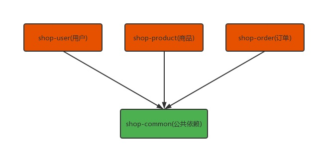
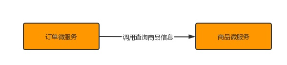
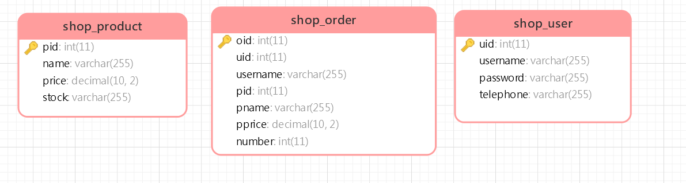
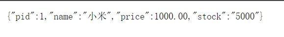

# 微服务环境搭建

> 我们本次是使用的电商项目中的商品、订单、用户为案例进行讲解。

## 案例准备

### 技术选型

| 工具            | 版本号    | 下载                                                                                   |
|---------------|--------|--------------------------------------------------------------------------------------|
| JDK           | 1.8    | https://www.oracle.com/technetwork/java/javase/downloads/jdk8-downloads-2133151.html |
| Mysql         | 5.7    | https://www.mysql.com/                                                               |
| Redis         | 5.0    | https://redis.io/download                                                            |
| Elasticsearch | 7.6.2  | https://www.elastic.co/cn/downloads/elasticsearch                                    |
| Kibana        | 7.6.2  | https://www.elastic.co/cn/downloads/kibana                                           |
| Logstash      | 7.6.2  | https://www.elastic.co/cn/downloads/logstash                                         |
| MongoDb       | 4.2.5  | https://www.mongodb.com/download-center                                              |
| RabbitMq      | 3.7.14 | http://www.rabbitmq.com/download.html                                                |
| nginx         | 1.10   | http://nginx.org/en/download.html                                                    |

### 后端技术
| 技术                     | 说明            | 官网                                                   |
|------------------------|---------------|------------------------------------------------------|
| Spring Cloud           | 微服务框架         | https://spring.io/projects/spring-cloud              |
| Spring Cloud Alibaba   | 微服务框架         | https://github.com/alibaba/spring-cloud-alibaba      |
| Spring Boot            | 容器+MVC框架      | https://spring.io/projects/spring-boot               |
| Spring Security Oauth2 | 认证和授权框架       | https://spring.io/projects/spring-security-oauth     |
| MyBatis                | ORM框架         | http://www.mybatis.org/mybatis-3/zh/index.html       |
| MyBatisGenerator       | 数据层代码生成       | http://www.mybatis.org/generator/index.html          |
| PageHelper             | MyBatis物理分页插件 | http://git.oschina.net/free/Mybatis_PageHelper       |
| Knife4j                | 文档生产工具        | https://github.com/xiaoymin/swagger-bootstrap-ui     |
| Elasticsearch          | 搜索引擎          | https://github.com/elastic/elasticsearch             |
| RabbitMq               | 消息队列          | https://www.rabbitmq.com/                            |
| Redis                  | 分布式缓存         | https://redis.io/                                    |
| MongoDb                | NoSql数据库      | https://www.mongodb.com/                             |
| Docker                 | 应用容器引擎        | https://www.docker.com/                              |
| Druid                  | 数据库连接池        | https://github.com/alibaba/druid                     |
| OSS                    | 对象存储          | https://github.com/aliyun/aliyun-oss-java-sdk        |
| MinIO                  | 对象存储          | https://github.com/minio/minio                       |
| JWT                    | JWT登录支持       | https://github.com/jwtk/jjwt                         |
| LogStash               | 日志收集          | https://github.com/logstash/logstash-logback-encoder |
| Lombok                 | 简化对象封装工具      | https://github.com/rzwitserloot/lombok               |
| Seata                  | 全局事务管理框架      | https://github.com/seata/seata                       |
| Portainer              | 可视化Docker容器管理 | https://github.com/portainer/portainer               |
| Jenkins                | 自动化部署工具       | https://github.com/jenkinsci/jenkins                 |
| Kubernetes             | 应用容器管理平台      | https://kubernetes.io/                               |

### 模块设计
``` lua
spring-cloud-alibaba-practice
├── shop-common -- 工具类及通用代码模块
├── shop-mbg -- MyBatisGenerator生成的数据库操作代码模块
├── shop-auth -- 基于Spring Security Oauth2的统一的认证中心（待更新）
├── shop-gateway -- 基于Spring Cloud Gateway的微服务API网关服务（待更新）
├── shop-monitor -- 基于Spring Boot Admin的微服务监控中心（待更新）
├── shop-user -- 用户微服务
├── shop-product -- 商品微服务
├── shop-order -- 订单微服务
└── config -- 配置中心存储的配置
```


### 微服务调用

> 在微服务架构中，最常见的场景就是微服务之间的相互调用。我们以电商系统中常见的用户下单为例来
演示微服务的调用：客户向订单微服务发起一个下单的请求，在进行保存订单之前需要调用商品微服务
查询商品的信息。
我们一般把服务的主动调用方称为服务消费者，把服务的被调用方称为服务提供者。



## 创建父工程
> 创建一个maven工程，然后在pom.xml文件中添加下面内容

```
<?xml version="1.0" encoding="UTF-8"?>
<project xmlns="http://maven.apache.org/POM/4.0.0"
         xmlns:xsi="http://www.w3.org/2001/XMLSchema-instance"
         xsi:schemaLocation="http://maven.apache.org/POM/4.0.0 http://maven.apache.org/xsd/maven-4.0.0.xsd">
    <modelVersion>4.0.0</modelVersion>

    <parent>
        <groupId>org.springframework.boot</groupId>
        <artifactId>spring-boot-starter-parent</artifactId>
        <version>2.3.12.RELEASE</version>
        <relativePath/>
    </parent>
    <groupId>com.rea</groupId>
    <artifactId>practical</artifactId>
    <packaging>pom</packaging>
    <version>1.0-SNAPSHOT</version>

    <modules>
        <module>shop-mbg</module>
        <module>shop-gateway</module>
        <module>shop-product</module>
        <module>shop-user</module>
        <module>shop-common</module>
        <module>shop-order</module>
    </modules>

    <properties>
        <mbg.version>1.4.0</mbg.version>
        <mybatis.version>3.5.8</mybatis.version>
        <spring-cloud.version>Hoxton.SR5</spring-cloud.version>
        <spring-cloud-alibaba.version>2.2.0.RELEASE</spring-cloud-alibaba.version>
        <pagehelper-starter.version>1.3.0</pagehelper-starter.version>
        <pagehelper.version>5.2.0</pagehelper.version>
        <knife4j.version>2.0.4</knife4j.version>
        <mybatis-generator.version>1.4.0</mybatis-generator.version>
        <mybatis.version>3.5.5</mybatis.version>
        <hutool.version>5.7.17</hutool.version>
        <druid.version>1.2.8</druid.version>
        <mysql-connector.version>8.0.20</mysql-connector.version>
        <spring-data-commons.version>2.3.0.RELEASE</spring-data-commons.version>
    </properties>

    <dependencies>
        <dependency>
            <groupId>org.springframework.boot</groupId>
            <artifactId>spring-boot-starter-actuator</artifactId>
        </dependency>
        <dependency>
            <groupId>org.springframework.boot</groupId>
            <artifactId>spring-boot-starter-aop</artifactId>
        </dependency>
        <dependency>
            <groupId>cn.hutool</groupId>
            <artifactId>hutool-all</artifactId>
        </dependency>
        <dependency>
            <groupId>org.springframework.boot</groupId>
            <artifactId>spring-boot-starter-test</artifactId>
            <scope>test</scope>
        </dependency>
        <dependency>
            <groupId>org.projectlombok</groupId>
            <artifactId>lombok</artifactId>
        </dependency>
    </dependencies>

    <dependencyManagement>
        <dependencies>
            <!--Spring Cloud 相关依赖-->
            <dependency>
                <groupId>org.springframework.cloud</groupId>
                <artifactId>spring-cloud-dependencies</artifactId>
                <version>${spring-cloud.version}</version>
                <type>pom</type>
                <scope>import</scope>
            </dependency>
            <!--Spring Cloud Alibaba 相关依赖-->
            <dependency>
                <groupId>com.alibaba.cloud</groupId>
                <artifactId>spring-cloud-alibaba-dependencies</artifactId>
                <version>${spring-cloud-alibaba.version}</version>
                <type>pom</type>
                <scope>import</scope>
            </dependency>
            <dependency>
                <groupId>com.rea</groupId>
                <artifactId>common</artifactId>
                <version>${project.version}</version>
            </dependency>
            <dependency>
                <groupId>com.rea</groupId>
                <artifactId>mbg</artifactId>
                <version>${project.version}</version>
            </dependency>
            <!--MyBatis分页插件starter-->
            <dependency>
                <groupId>com.github.pagehelper</groupId>
                <artifactId>pagehelper-spring-boot-starter</artifactId>
                <version>${pagehelper-starter.version}</version>
            </dependency>
            <!--MyBatis分页插件-->
            <dependency>
                <groupId>com.github.pagehelper</groupId>
                <artifactId>pagehelper</artifactId>
                <version>${pagehelper.version}</version>
            </dependency>
            <!--集成druid连接池-->
            <dependency>
                <groupId>com.alibaba</groupId>
                <artifactId>druid-spring-boot-starter</artifactId>
                <version>${druid.version}</version>
            </dependency>
            <!--Hutool Java工具包-->
            <dependency>
                <groupId>cn.hutool</groupId>
                <artifactId>hutool-all</artifactId>
                <version>${hutool.version}</version>
            </dependency>
            <!--Knife4j API文档生产工具-->
            <dependency>
                <groupId>com.github.xiaoymin</groupId>
                <artifactId>knife4j-micro-spring-boot-starter</artifactId>
                <version>${knife4j.version}</version>
            </dependency>
            <dependency>
                <groupId>com.github.xiaoymin</groupId>
                <artifactId>knife4j-spring-boot-starter</artifactId>
                <version>${knife4j.version}</version>
            </dependency>
            <!-- MyBatis 生成器 -->
            <dependency>
                <groupId>org.mybatis.generator</groupId>
                <artifactId>mybatis-generator-core</artifactId>
                <version>${mybatis-generator.version}</version>
            </dependency>
            <!-- MyBatis-->
            <dependency>
                <groupId>org.mybatis</groupId>
                <artifactId>mybatis</artifactId>
                <version>${mybatis.version}</version>
            </dependency>
            <!--Mysql数据库驱动-->
            <dependency>
                <groupId>mysql</groupId>
                <artifactId>mysql-connector-java</artifactId>
                <version>${mysql-connector.version}</version>
            </dependency>
            <!--JWT(Json Web Token)登录支持-->
            <dependency>
                <groupId>io.jsonwebtoken</groupId>
                <artifactId>jjwt</artifactId>
                <version>${jjwt.version}</version>
            </dependency>
            <!--JWT(Json Web Token)登录支持-->
            <dependency>
                <groupId>com.nimbusds</groupId>
                <artifactId>nimbus-jose-jwt</artifactId>
                <version>${nimbus-jose-jwt.version}</version>
            </dependency>
        </dependencies>
    </dependencyManagement>

</project>
```

## 创建基础模块
> 创建 shop-common 模块，在pom.xml中添加依赖

```
<?xml version="1.0" encoding="UTF-8"?>
<project xmlns="http://maven.apache.org/POM/4.0.0"
         xmlns:xsi="http://www.w3.org/2001/XMLSchema-instance"
         xsi:schemaLocation="http://maven.apache.org/POM/4.0.0 http://maven.apache.org/xsd/maven-4.0.0.xsd">
    <parent>
        <artifactId>practical</artifactId>
        <groupId>com.rea</groupId>
        <version>1.0-SNAPSHOT</version>
    </parent>

    <modelVersion>4.0.0</modelVersion>

    <artifactId>common</artifactId>

    <dependencies>
        <dependency>
            <groupId>com.github.pagehelper</groupId>
            <artifactId>pagehelper</artifactId>
        </dependency>
        <dependency>
            <groupId>org.springframework.boot</groupId>
            <artifactId>spring-boot-starter-web</artifactId>
        </dependency>
        <dependency>
            <groupId>org.springframework.boot</groupId>
            <artifactId>spring-boot-starter-data-redis</artifactId>
        </dependency>
        <dependency>
            <groupId>com.github.xiaoymin</groupId>
            <artifactId>knife4j-micro-spring-boot-starter</artifactId>
        </dependency>
    </dependencies>

</project>
```

## 创建数据库操作代码模块

### 项目数据库设计
 `shop`


> SQL文件
```mysql
/*
 Navicat Premium Data Transfer

 Source Server         : localhost
 Source Server Type    : MySQL
 Source Server Version : 80017
 Source Host           : localhost:3306
 Source Schema         : shop

 Target Server Type    : MySQL
 Target Server Version : 80017
 File Encoding         : 65001

 Date: 14/12/2021 23:35:21
*/

SET NAMES utf8mb4;
SET FOREIGN_KEY_CHECKS = 0;

-- ----------------------------
-- Table structure for shop_order
-- ----------------------------
DROP TABLE IF EXISTS `shop_order`;
CREATE TABLE `shop_order`  (
  `oid` int(11) NOT NULL AUTO_INCREMENT COMMENT '订单id',
  `uid` int(11) NULL DEFAULT NULL COMMENT '用户id',
  `username` varchar(255) CHARACTER SET utf8mb4 COLLATE utf8mb4_bin NULL DEFAULT NULL COMMENT '用户名',
  PRIMARY KEY (`oid`) USING BTREE
) ENGINE = InnoDB CHARACTER SET = utf8mb4 COLLATE = utf8mb4_bin ROW_FORMAT = Dynamic;

-- ----------------------------
-- Table structure for shop_product
-- ----------------------------
DROP TABLE IF EXISTS `shop_product`;
CREATE TABLE `shop_product`  (
  `pid` int(11) NOT NULL AUTO_INCREMENT COMMENT '商品id',
  `name` varchar(255) CHARACTER SET utf8mb4 COLLATE utf8mb4_bin NULL DEFAULT NULL COMMENT '商品名称',
  `price` decimal(10, 2) NULL DEFAULT NULL COMMENT '商品价格',
  `stock` varchar(255) CHARACTER SET utf8mb4 COLLATE utf8mb4_bin NULL DEFAULT NULL COMMENT '库存',
  PRIMARY KEY (`pid`) USING BTREE
) ENGINE = InnoDB CHARACTER SET = utf8mb4 COLLATE = utf8mb4_bin ROW_FORMAT = Dynamic;

-- ----------------------------
-- Table structure for shop_user
-- ----------------------------
DROP TABLE IF EXISTS `shop_user`;
CREATE TABLE `shop_user`  (
  `uid` int(11) NOT NULL AUTO_INCREMENT COMMENT '用户id',
  `username` varchar(255) CHARACTER SET utf8mb4 COLLATE utf8mb4_bin NULL DEFAULT NULL COMMENT '用户名',
  `password` varchar(255) CHARACTER SET utf8mb4 COLLATE utf8mb4_bin NULL DEFAULT NULL COMMENT '密码',
  `telephone` varchar(255) CHARACTER SET utf8mb4 COLLATE utf8mb4_bin NULL DEFAULT NULL COMMENT '手机号',
  PRIMARY KEY (`uid`) USING BTREE
) ENGINE = InnoDB CHARACTER SET = utf8mb4 COLLATE = utf8mb4_bin ROW_FORMAT = Dynamic;

SET FOREIGN_KEY_CHECKS = 1;

```

### Mybatis generator 配置文件

> 配置generator.properties文件用于配置MysqlDB链接数据

```properties
jdbc.driverClass=com.mysql.cj.jdbc.Driver
jdbc.connectionURL=jdbc:mysql://localhost:3306/shop?useUnicode=true&characterEncoding=utf-8&serverTimezone=Asia/Shanghai
jdbc.userId=root
jdbc.password=root
```

> 配置generatorConfig.xml文件用于设定生成Java、SQL文件

```xml
<?xml version="1.0" encoding="UTF-8"?>
<!DOCTYPE generatorConfiguration
        PUBLIC "-//mybatis.org//DTD MyBatis Generator Configuration 1.0//EN"
        "http://mybatis.org/dtd/mybatis-generator-config_1_0.dtd">

<generatorConfiguration>
    <properties resource="generator.properties"/>
    <context id="MySqlContext" targetRuntime="MyBatis3" defaultModelType="flat">
        <property name="beginningDelimiter" value="`"/>
        <property name="endingDelimiter" value="`"/>
        <property name="javaFileEncoding" value="UTF-8"/>
        <!-- 为模型生成序列化方法-->
        <plugin type="org.mybatis.generator.plugins.SerializablePlugin"/>
        <!-- 为生成的Java模型创建一个toString方法 -->
        <plugin type="org.mybatis.generator.plugins.ToStringPlugin"/>
        <!--生成mapper.xml时覆盖原文件-->
        <plugin type="org.mybatis.generator.plugins.UnmergeableXmlMappersPlugin" />
        <commentGenerator type="com.rea.mbg.CommentGenerator">
            <!-- 是否去除自动生成的注释 true：是 ： false:否 -->
            <property name="suppressAllComments" value="true"/>
            <property name="suppressDate" value="true"/>
            <property name="addRemarkComments" value="true"/>
        </commentGenerator>

        <jdbcConnection driverClass="${jdbc.driverClass}"
                        connectionURL="${jdbc.connectionURL}"
                        userId="${jdbc.userId}"
                        password="${jdbc.password}">
            <!--解决mysql驱动升级到8.0后不生成指定数据库代码的问题-->
            <property name="nullCatalogMeansCurrent" value="true" />
        </jdbcConnection>

        <!--表对应的实体类生成位置-->
        <javaModelGenerator targetPackage="com.rea.mbg.model" targetProject="mbg/src/main/java"/>

        <!--表对应的CRUD SQL语句生成位置-->
        <sqlMapGenerator targetPackage="com.rea.mbg.mapper" targetProject="mbg/src/main/resources"/>

        <!--表对应的CRUD接口方法生成位置-->
        <javaClientGenerator type="XMLMAPPER" targetPackage="com.rea.mbg.mapper" targetProject="mbg/src/main/java"/>

        <!--生成全部表tableName设为%-->
        <table tableName="%">
            <generatedKey column="id" sqlStatement="MySql" identity="true"/>
        </table>
    </context>
</generatorConfiguration>
```

### 运行Generator的main函数生成代码

> 自定义注释生成器
```java
package com.rea.mbg;

import org.mybatis.generator.api.IntrospectedColumn;
import org.mybatis.generator.api.IntrospectedTable;
import org.mybatis.generator.api.dom.java.CompilationUnit;
import org.mybatis.generator.api.dom.java.Field;
import org.mybatis.generator.api.dom.java.FullyQualifiedJavaType;
import org.mybatis.generator.internal.DefaultCommentGenerator;
import org.mybatis.generator.internal.util.StringUtility;

import java.util.Properties;

/**
 * 自定义注释生成器
 * @author CRR
 */
public class CommentGenerator extends DefaultCommentGenerator {
    private boolean addRemarkComments = false;
    private static final String EXAMPLE_SUFFIX = "Example";
    private static final String MAPPER_SUFFIX = "Mapper";
    private static final String API_MODEL_PROPERTY_FULL_CLASS_NAME = "io.swagger.annotations.ApiModelProperty";

    /**
     * 设置用户配置的参数
     * @param properties
     */
    @Override
    public void addConfigurationProperties(Properties properties) {
        super.addConfigurationProperties(properties);
        this.addRemarkComments = StringUtility.isTrue(properties.getProperty("addRemarkComments"));
    }

    /**
     * 给字段添加注释
     * @param field
     * @param introspectedTable
     * @param introspectedColumn
     */
    @Override
    public void addFieldComment(Field field, IntrospectedTable introspectedTable,
                                IntrospectedColumn introspectedColumn) {
        String remarks = introspectedColumn.getRemarks();
        //根据参数和备注信息判断是否添加备注信息
        if(addRemarkComments && StringUtility.stringHasValue(remarks)) {
//            addFieldJavaDoc(field, remarks);
            //数据库中特殊字符需要转义
            if(remarks.contains("\"")) {
                remarks = remarks.replace("\"","'");
            }
            //给model的字段添加swagger注解
            field.addJavaDocLine("@ApiModelProperty(value = \""+remarks+"\")");
        }
    }

    /**
     * 给model的字段添加注释
     * @param field
     * @param remarks
     */
    private void addFieldJavaDoc(Field field, String remarks) {
        //文档注释开始
        field.addJavaDocLine("/**");
        //获取数据库字段的备注信息
        String[] remarkLines = remarks.split(System.getProperty("line.separator"));
        for(String remarkLine:remarkLines) {
            field.addJavaDocLine(" * "+remarkLine);
        }
        addJavadocTag(field, false);
        field.addJavaDocLine(" */");
    }

    @Override
    public void addJavaFileComment(CompilationUnit compilationUnit) {
        super.addJavaFileComment(compilationUnit);
        //只在model中添加swagger注解类的导入
        String fullyQualifiedName = compilationUnit.getType().getFullyQualifiedName();
        if(!fullyQualifiedName.contains(MAPPER_SUFFIX)
            && !fullyQualifiedName.contains(EXAMPLE_SUFFIX)) {
            compilationUnit.addImportedType(new FullyQualifiedJavaType(API_MODEL_PROPERTY_FULL_CLASS_NAME));
        }
    }
}
```

> 用于生产MBG的代码，运行
```java
package com.rea.mbg;

import org.mybatis.generator.api.MyBatisGenerator;
import org.mybatis.generator.config.Configuration;
import org.mybatis.generator.config.xml.ConfigurationParser;
import org.mybatis.generator.internal.DefaultShellCallback;

import java.io.InputStream;
import java.util.ArrayList;
import java.util.List;

/**
 * 用于生产MBG的代码
 * @author CRR
 */
public class Generator {
    public static void main(String[] args) throws Exception {
        //MBG 执行过程中的警告信息
        List<String> warnings = new ArrayList<>();
        //当生成的代码重复时，覆盖原代码
        boolean overwrite = true;
        //读取我们的 MBG 配置文件
        InputStream is = Generator.class.getResourceAsStream("/generatorConfig.xml");
        ConfigurationParser cp = new ConfigurationParser(warnings);
        Configuration config = cp.parseConfiguration(is);
        assert is != null;
        is.close();

        DefaultShellCallback callback = new DefaultShellCallback(overwrite);
        //创建 MBG
        MyBatisGenerator myBatisGenerator = new MyBatisGenerator(config, callback, warnings);
        //执行生成代码
        myBatisGenerator.generate(null);
        //输出警告信息
        for(String warning : warnings) {
            System.out.println(warning);
        }
    }
}
```

## 创建用户微服务

1. 创建模块 导入依赖
2. 创建SpringBoot主类
3. 加入配置文件
4. 创建必要的接口和实现类(controller service dao)

> 新建一个 shop-user 模块，然后进行下面操作

### 修改pom文件
```xml
<?xml version="1.0" encoding="UTF-8"?>
<project xmlns="http://maven.apache.org/POM/4.0.0"
         xmlns:xsi="http://www.w3.org/2001/XMLSchema-instance"
         xsi:schemaLocation="http://maven.apache.org/POM/4.0.0 http://maven.apache.org/xsd/maven-4.0.0.xsd">
    <parent>
        <artifactId>practical</artifactId>
        <groupId>com.rea</groupId>
        <version>1.0-SNAPSHOT</version>
    </parent>
    <modelVersion>4.0.0</modelVersion>

    <artifactId>shop-user</artifactId>

    <dependencies>
        <dependency>
            <groupId>com.rea</groupId>
            <artifactId>shop-common</artifactId>
        </dependency>
        <dependency>
            <groupId>com.rea</groupId>
            <artifactId>shop-mbg</artifactId>
        </dependency>
    </dependencies>

</project>
```

### 编写主类
> 在src/main/java目录下新建UserApplication Java文件

```java
package com.rea.user;

import org.springframework.boot.SpringApplication;
import org.springframework.boot.autoconfigure.SpringBootApplication;
import org.springframework.cloud.client.discovery.EnableDiscoveryClient;

/**
 * @author CRR
 */
@SpringBootApplication
@EnableDiscoveryClient
public class UserApplication {
    public static void main(String[] args) {
        SpringApplication.run(UserApplication.class, args);
    }
}
```

### 创建配置文件
> 在src/main/resources目录下新建application.yml文件，用于配置DB链接

```yaml
spring:
  datasource:
    url: jdbc:mysql://localhost:3306/shop?useUnicode=true&characterEncoding=utf-8&serverTimezone=Asia/Shanghai
    username: root
    password: root
    druid:
      initial-size: 5 #连接池初始化大小
      min-idle: 10 #最小空闲连接数
      max-active: 20 #最大连接数
      web-stat-filter:
        exclusions: "*.js,*.gif,*.jpg,*.png,*.css,*.ico,/druid/*" #不统计这些请求数据
      stat-view-servlet: #访问监控网页的登录用户名和密码
        login-username: druid
        login-password: druid

```
> 在src/mail/resources目录下新建bootstrap.yml文件，用于配置项目名称、端口号等

```yaml
server:
  port: 8009
spring:
  profiles:
    active: dev
  application:
    name: shop-user
```

## 创建商品微服务

### 创建一个名为 shop_product 的模块，并添加springboot依赖
```xml
<?xml version="1.0" encoding="UTF-8"?>
<project xmlns="http://maven.apache.org/POM/4.0.0"
         xmlns:xsi="http://www.w3.org/2001/XMLSchema-instance"
         xsi:schemaLocation="http://maven.apache.org/POM/4.0.0 http://maven.apache.org/xsd/maven-4.0.0.xsd">
    <parent>
        <artifactId>practical</artifactId>
        <groupId>com.rea</groupId>
        <version>1.0-SNAPSHOT</version>
    </parent>
    <modelVersion>4.0.0</modelVersion>

    <artifactId>shop-product</artifactId>

    <dependencies>
        <dependency>
            <groupId>com.rea</groupId>
            <artifactId>shop-common</artifactId>
        </dependency>
        <dependency>
            <groupId>com.rea</groupId>
            <artifactId>shop-mbg</artifactId>
        </dependency>
        <dependency>
            <groupId>org.springframework.cloud</groupId>
            <artifactId>spring-cloud-starter</artifactId>
        </dependency>
    </dependencies>

</project>
```

### 创建工程的主类
> 在src/main/java目录下新建ProductApplication Java文件
```java
package com.rea.product;

import org.springframework.boot.SpringApplication;
import org.springframework.boot.autoconfigure.SpringBootApplication;

/**
 * @author CRR
 */
@SpringBootApplication
public class ProductApplication {
    public static void main(String[] args) {
        SpringApplication.run(ProductApplication.class, args);
    }
}


```
### 创建配置文件
> 在src/mail/resources目录下新建application.yml文件，用于配置DB链接

```yaml
spring:
  datasource:
    url: jdbc:mysql://localhost:3306/shop?useUnicode=true&characterEncoding=utf-8&serverTimezone=Asia/Shanghai
    username: root
    password: root
    druid:
      initial-size: 5 #连接池初始化大小
      min-idle: 10 #最小空闲连接数
      max-active: 20 #最大连接数
      web-stat-filter:
        exclusions: "*.js,*.gif,*.jpg,*.png,*.css,*.ico,/druid/*" #不统计这些请求数据
      stat-view-servlet: #访问监控网页的登录用户名和密码
        login-username: druid
        login-password: druid

```
> 在src/mail/resources目录下新建bootstrap.yml文件，用于配置项目名称、端口号等

```yaml
server:
  port: 8010
spring:
  profiles:
    active: dev
  application:
    name: shop-product
```

### 创建ProductService接口和实现类
> 创建com.rea.product.config.MyBatisConfig类，用于扫描mbg的mapper、model
```java
package com.rea.product.config;

import org.mybatis.spring.annotation.MapperScan;
import org.springframework.context.annotation.Configuration;

/**
 * @author CRR
 */
@Configuration
@MapperScan({"com.rea.mbg.mapper", "com.rea.mbg.mapper.model"})
public class MyBatisConfig {
}
```
> 创建接口com.rea.product.service.ProductService
```java
package com.rea.product.service;

import com.rea.mbg.model.ShopProduct;

/**
 * @author CRR
 */
public interface ProductService {
    /**
     * 根据商品id取得商品信息
     * @param pid
     * @return
     */
    ShopProduct findByPid(Integer pid);
}

```
> 创建ProductService接口的实现类com.rea.product.service.impl.ProductServiceImpl
```java
package com.rea.product.service.impl;

import com.rea.mbg.mapper.ShopProductMapper;
import com.rea.mbg.model.ShopProduct;
import com.rea.product.service.ProductService;
import org.springframework.beans.factory.annotation.Autowired;
import org.springframework.stereotype.Service;

/**
 * @author CRR
 */
@Service
public class ProductServiceImpl implements ProductService {
    @Autowired
    private ShopProductMapper shopProductMapper;

    @Override
    public ShopProduct findByPid(Integer pid) {
        return shopProductMapper.selectByPrimaryKey(pid);
    }
}

```

### 创建Controller
> 创建客户端访问控制类

```java
package com.rea.product.controller;

import com.alibaba.fastjson.JSON;
import com.rea.mbg.model.ShopProduct;
import com.rea.product.service.ProductService;
import lombok.extern.slf4j.Slf4j;
import org.springframework.beans.factory.annotation.Autowired;
import org.springframework.web.bind.annotation.RestController;

/**
 * @author CRR
 */
@RestController
@Slf4j
public class ProductController {

    @Autowired
    private ProductService productService;

    @GetMapping("/getProduct")
    public ShopProduct getProduct(Integer pid) {
        ShopProduct product = productService.findByPid(pid);
        log.info("查询到商品:" + JSON.toJSONString(product));
        return product;
    }
}

```

### 创建测试数据

```mysql
INSERT INTO shop_product VALUE(NULL,'小米','1000','5000');
INSERT INTO shop_product VALUE(NULL,'华为','2000','5000');
INSERT INTO shop_product VALUE(NULL,'苹果','3000','5000');
INSERT INTO shop_product VALUE(NULL,'OPPO','4000','5000');
```

### 启动项目，测试Api

[http://localhost:8009/getProduct?pid=1](http://localhost:8009/getProduct?pid=1)


## 创建订单微服务

### 创建一个名为 shop-order 的模块,并添加springboot依赖
```xml

```