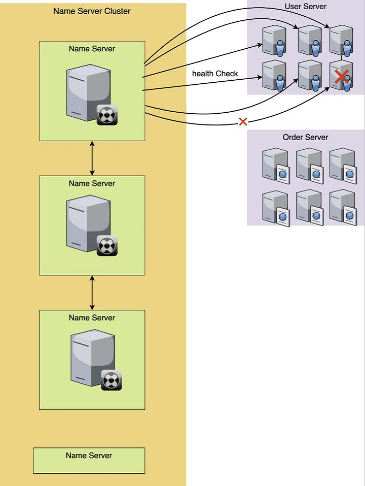

# Nacos Discovery--服务治理

## 服务注册与发现

### 什么是服务注册与发现

> **服务注册**，就是将提供某个服务的模块信息(通常是这个服务的ip和端口)注册到1个公共的组件上去  
> **服务发现**，就是新注册的这个服务模块能够及时的被其他调用者发现。不管是服务新增和服务删减都能实现自动发现。

### 微服务时代的服务管理

> 在微服务时代，我们所有的服务都被尽量拆分成最小的粒度，原先所有的服务都在混在1个server里，现在就被按照功能或者对象拆分成N个服务模块，这样做的好处是深度解耦，1个模块只负责自己的事情就好，能够实现快速的迭代更新。坏处就是服务的管理和控制变得异常的复杂和繁琐，人工维护难度变大。还有排查问题和性能变差（服务调用时的网络开销）


比如上面的图中，我们将原先1个server的服务进行了拆分，拆出了User服务，Order服务，Goods服务，Search服务等等。每个服务里有N台机器或者实例。每个服务还相互关联和调动。这种错综复杂的网络架构，使得这种服务的维护成本变得比之前困难了很多。

各个微服务相互独立，每个微服务，由多台机器或者单机器不同的实例组成，各个微服务之间错综复杂的相互关联调用。在不用服务注册之前，我们可以想象一下，怎么去维护这种复杂的关系网络呢？**答案就是：写死！**。

### 服务注册

还是上面服务模块的例子，我们看下用了服务注册和服务发现之后，我们的网络请求模块，发生了怎么的变化呢？先来看下，服务注册是怎么操作的。看下面的图：


每一个服务对应的机器或者实例在启动运行的时候，都去向名字服务集群注册自己，比如图中，User服务有6个docker实例，那么每个docker实例，启动后，都去把自己的信息注册到名字服务模块上去，同理Order服务也是一样
这样，每个服务的机器实例在启动后，就完成了注册的操作。注册的方式有很多的形式，不同的名字服务软件方式不一样，有HTTP接口形式，有RPC的方式，也有使用JSON格式的配置表的形式的。方式虽然不同，但是结果都是一样。
实例注册到名字服务上之后，接下来就是**服务发现**了。

### 服务发现

我们把每个服务的机器实例注册到了名字服务器上之后，接下来，我们如何去发现我们需要调用的服务的信息呢？这就是服务发现了。

我们看下，服务发现是怎么做的：


在上图中，Order服务想要获取User服务相关的信息，首先向注册集群中心发送请求获取，然后就能收到User服务相关的信息。
我们通过服务发现，就获得了User模块的所有的ip列表，然后，我们再用一定的负载均衡算法，或者干脆随机取1个ip，进行调用。

当然，也有些注册服务软件也提供了DNS解析功能或者负载均衡功能，它会直接返回给你一个可用的ip，你直接调用就可以了，不用自己去做选择。

这样，我们获取了服务的IP信息后，就可以进行调用了，如图所示：


和服务注册的方式一样，服务发现的方式，不同的名字服务软件的方式也会不一样，有的是得自己发送HTTP接口去**轮训调用**，如果发现有更新，就更新自己本地的配置文件。有的是可以通过实时的sub/pub的方式实现的**自动发现服务**，当我订阅的这个服务内容发生了更新，就实时更新自己的配置文件。也有的是通过RPC的方式。方式虽然不同，但是结果都是一样。

**这样一来，我们就可以通过服务注册和发现的方式，维护各个服务IP列表的更新，各个模块只需要向名字服务中心去获取某个服务的IP就可以了，不用再写死IP。整个服务的维护也变得轻松了很多。彻底解放了双手！**

### 健康检查

可能你会说，这样加了1个中间代理，饶了一个大圈子，感觉也挺费劲的，难道仅仅是为了解决新增服务，动态获取IP的问题吗？

当然不是！服务注册和服务发现，不仅仅解决了服务调用这种写死IP以及杂乱无章的管理的状态，更重要的一点是它还管理了服务器的存活状态，也就是**健康检查**。

很多名字服务软件都会提供健康检查功能。注册服务的这一组机器，当这个服务组的某台机器，如果出现宕机或者服务死掉的时候，就会标记这个实例的状态为故障，或者干脆剔除掉这台机器。这样一来，就实现了自动监控和管理。

健康检查有多重实现方式，比如有几秒就发一次健康检查心跳，如果返回的HTTP状态不是200，那么就判断这台服务不可用，对它进行标记。也可以执行一个shell脚本，看执行的返回结果，来标记状态等等。



上图中，用心跳发送的方式来检查健康状态，当有1台机器出现异常，这样我们获取服务的时候，就能知道服务的健康状态了。

我们通过判断列表里的status的状态是不是success来确认调用的服务是可用的。有些名字服务会提供DNS解析功能，直接就会把有问题的机器给去掉，你服务发现后的机器服务就是正常可用的。

同时，当服务不可用的时候，有些名字服务软件也会提供发送邮件或者消息功能，及时的提示你服务出现故障。这样一来，我们就通过健康检查功能，来帮我们及时的去规避问题，降低影响。

当出现故障的服务被修复后，服务重新启动后，健康检查会检查通过，然后这台机器就会被标记为健康，这样，服务发现，就又可以发现这台机器了。

这样，整个服务注册和服务发现，就实现了闭环。

### 各类注册中心对比


> CAP理论：一个分布式系统不可能同时满足C(一致性)、A(可用性)和P(分区容错性)

* 一致性是指“all nodes see the same data at the same time”，即更新操作成功后，所有节点在同一时间的数据完全一致。
* 可用性是指“reads and writes always succeed”，即用户访问数据时，系统是否能在正常响应时间返回结果。
* 分区容错性是指“the system continues to operate despite arbitrary message loss or failure of part of the system”，即分布式系统在遇到某节点或网络分区故障的时候，仍然能够对外提供满足一致性和可用性的服务。

**CA without P**

如果不要求 Partition Tolerance，即不允许分区，则强一致性和可用性是可以保证的。其实分区是始终存在的问题，因此 CA 的分布式系统更多的是允许分区后各子系统依然保持 CA。

**CP without A**

如果不要求可用性，相当于每个请求都需要在各服务器之间强一致，而分区容错性会导致同步时间无限延长，如此 CP 也是可以保证的。很多传统的数据库分布式事务都属于这种模式。

**AP without C**

如果要可用性高并允许分区，则需放弃一致性。一旦分区发生，节点之间可能会失去联系，为了实现高可用，每个节点只能用本地数据提供服务，而这样会导致全局数据的不一致性。


## nacos简介

Nacos 致力于帮助您发现、配置和管理微服务。Nacos 提供了一组简单易用的特性集，帮助您快速实现
动态服务发现、服务配置、服务元数据及流量管理。
从上面的介绍就可以看出，nacos的作用就是一个**注册中心**，用来管理注册上来的各个微服务。

## nacos实战入门

### 搭建nacos环境

1. Nacos安装并解压

下载地址：[https://github.com/alibaba/nacos/releases](https://github.com/alibaba/nacos/releases)


2. Nacos启动

* 进入bin目录下，双击startup.cmd文件启动Nacos
* 浏览器地址栏输入：[http://localhost:8848/nacos](http://localhost:8848/nacos)
* 默认用户名/密码：nacos/nacos


### 将商品微服务注册到nacos

接下来开始修改 shop-product 模块的代码， 将其注册到nacos服务上
1. 在pom.xml中添加nacos的依赖

```xml
<dependencies>
    <!--nacos service discovery client依赖-->
    <dependency>
        <groupId>com.alibaba.cloud</groupId>
        <artifactId>spring-cloud-starter-alibaba-nacos-discovery</artifactId>
    </dependency>
</dependencies>
```

2. 在主类上添加@EnableDiscoveryClient注解

```java
package com.rea.product;

import org.springframework.boot.SpringApplication;
import org.springframework.boot.autoconfigure.SpringBootApplication;
import org.springframework.cloud.client.discovery.EnableDiscoveryClient;

/**
 * @author CRR
 */
@SpringBootApplication
@EnableDiscoveryClient
public class ProductApplication {
    public static void main(String[] args) {
        SpringApplication.run(ProductApplication.class, args);
    }
}
```
3. 在nacos控制台界面新建命名空间dev


4. bootstrap-dev.yml中添加nacos服务的地址

其中namespace拷贝刚刚新建的命名空间ID
```yaml
spring:
  cloud:
    nacos:
      discovery:
        server-addr: 127.0.0.1:8848
        namespace: dfa414fe-6383-45bc-9a31-803a9c475c57
```

5. 启动服务， 观察nacos的控制面板中是否有注册上来的商品微服务


### 将订单微服务注册到nacos

参照商品微服务，将订单微服务注册到nacos上


