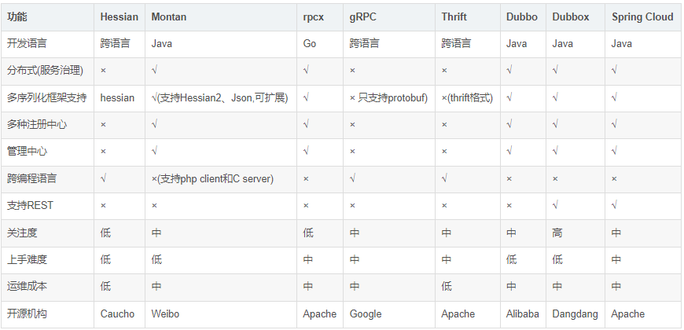

# Dubbo--远程调用

## 服务调用

### Spring Cloud为什么需要RPC

> 在Spring Cloud构建的微服务系统中，大多数的开发者使用都是官方提供的Feign组件来进行内部服务通信，这种声明式的HTTP客户端使用起来非常的简洁、方便、优雅，并且和开发平台、语言无关，但是通常情况下，HTTP并不会开启KeepAlive功能，即当前连接为短连接，短连接的缺点是每次请求都需要建立TCP连接，这使得其效率变得相当低下。

> 对外部提供REST API服务是一件非常好的事情，但是如果内部调用也是使用HTTP调用方式，就会显得显得性能低下，Spring Cloud默认使用的Feign组件进行内部服务调用就是使用的HTTP协议进行调用，这时，我们如果内部服务使用RPC调用，对外使用REST API，将会是一个非常不错的选择。

### 什么是RPC

> RPC(Remote Procedure Call Protocol)远程过程调用协议:
它是一种通过网络从远程计算机程序上请求服务，而不需要了解底层网络技术的协议。
简言之，RPC使得程序能够像访问本地系统资源一样，去访问远端系统资源。
比较关键的一些方面包括：
通讯协议、序列化、资源(接口)描述、服务框架、性能、语言支持等。

简单的说:RPC就是从一台机器(客户端)上通过参数传递的方式调用另一台机器(服务器)上的一个函数或方法(可以统称为服务)，并得到返回的结果。

### RPC 调用的分类

> 从调用过程来看，可以分为同步通信RPC和异步通信RPC
* 同步调用：客户端等待调用执行完成并获取到执行结果。
* 异步调用：客户端调用后不用等待执行结果返回，但依然可以通过回调通知等方式获取返回结果。
  若客户端不关心调用返回结果，则变成单向异步调用，单向调用不用返回结果。
  异步和同步的区分在于是否等待服务端执行完成并返回结果。

> 从是否跨平台可分为
* 单语言 RPC，如 RMI, Remoting；
* 跨平台 RPC，如 google protobuffer, restful json，http XML。

> 从通信协议层面可以分为
* 基于 HTTP 协议的 RPC；
* 基于二进制协议的 RPC；
* 基于 TCP 协议的 RPC。

### 各RPC框架对比



### 为什么使用Dubbo

在Spring Cloud构建的微服务系统中，大多数的开发者使用都是官方提供的Feign组件来进行内部服务通信，这种声明式的HTTP客户端使用起来非常的简洁、方便、优雅，但是有一点，在使用Feign消费服务的时候，相比较Dubbo这种RPC框架而言，性能堪忧。

虽说在微服务架构中，会讲按照业务划分的微服务独立部署，并且运行在各自的进程中。微服务之间的通信更加倾向于使用HTTP这种简答的通信机制，大多数情况都会使用REST API。这种通信方式非常的简洁高效，并且和开发平台、语言无关，但是通常情况下，HTTP并不会开启KeepAlive功能，即当前连接为短连接，短连接的缺点是每次请求都需要建立TCP连接，这使得其效率变的相当低下。

对外部提供REST API服务是一件非常好的事情，但是如果内部调用也是使用HTTP调用方式，就会显得显得性能低下，Spring Cloud默认使用的Feign组件进行内部服务调用就是使用的HTTP协议进行调用，这时，我们如果内部服务使用RPC调用，对外使用REST API，将会是一个非常不错的选择，恰巧，Dubbo Spring Cloud给了我们这种选择的实现方式。

### Dubbo负载均衡

> 当我们对内使用Dubbo的RPC通信，不再使用RestTemplate或feign的 HTTP通信时，我们要怎么使用负载均衡呢？

在 Dubbo 中，也有负载均衡的概念和相应的实现。Dubbo 需要对服务消费者的调用请求进行分配，避免少数服务提供者负载过大。服务提供者负载过大，会导致部分请求超时。因此将负载均衡到每个服务提供者上，是非常必要的。Dubbo 提供了4种负载均衡实现:
* 基于权重随机算法的 RandomLoadBalance
* 基于最少活跃调用数算法的 LeastActiveLoadBalance
* 基于 hash 一致性的 ConsistentHashLoadBalance
* 基于加权轮询算法的 RoundRobinLoadBalance。

> 源码分析

Dubbo负载均衡的源码在 org.apache.dubbo:dubbo下的org.apache.dubbo.rpc.cluster.loadbalance通过源码可以发现4个负载均衡策略的实现类都继承了AbstractLoadBalance抽象类，而AbstractLoadBalance实现了LoadBalance接口。再来看看LoadBalance接口，可以知道duboo是通过 loadbalance属性来适配负载均衡接口的实现类，且默认值为 random权重随机。所以，我们只要在@Reference注解里添加 loadbalance属性，就可以选择dubbo的负载均衡策略了

loadbalance属性值为负载均衡实现类的 NAME属性，分别是：
random 、roundrobin 、leastactive 、consistenthash

```java
@Reference(version = "1.0.0", loadbalance = "roundrobin")
EchoService echoService;
```

## 场景描述

> 订单服务调用商品服务查询商品信息

## 修改服务提供者-商品服务

1. 修改pom文件，引入dubbo相关依赖

```xml
<dependencies>
    <!-- Dubbo Spring Cloud Starter -->
    <dependency>
        <groupId>com.alibaba.cloud</groupId>
        <artifactId>spring-cloud-starter-dubbo</artifactId>
    </dependency>
</dependencies>
```

2. 修改配置文件

修改bootstrap-dev.yml文件

```yaml
dubbo:
  scan:
    base-packages: com.rea.product.service
  protocols:
    dubbo:
      name: dubbo
      port: -1
  registry:
    address: spring-cloud://localhost
```

3. 修改商品服务ProductServiceImpl类

```java
package com.rea.product.service.impl;

import com.rea.mbg.mapper.ShopProductMapper;
import com.rea.mbg.model.ShopProduct;
import com.rea.product.service.ProductService;
import org.apache.dubbo.config.annotation.Service;
import org.springframework.beans.factory.annotation.Autowired;
import org.springframework.web.bind.annotation.RequestMapping;
import org.springframework.web.bind.annotation.RequestMethod;

/**
 * @author CRR
 */
@Service
public class ProductServiceImpl implements ProductService {
    @Autowired
    private ShopProductMapper shopProductMapper;

    //这里需要使用rest风格的Api调用格式，供服务消费者使用
    @Override
    @RequestMapping(value = "findByPid", method = RequestMethod.POST)
    public ShopProduct findByPid(Integer pid) {
        log.info(">-----远程调用商品服务查找商品");
        return shopProductMapper.selectByPrimaryKey(pid);
    }
}
```

> 注意：现在@Service为dubbo下的Service注解，

## 修改服务消费者-订单服务

1. 修改pom文件，引入dubbo相关依赖，同application服务
2. pom文件中引入商品服务依赖

完整pom文件

```xml
<?xml version="1.0" encoding="UTF-8"?>
<project xmlns="http://maven.apache.org/POM/4.0.0"
         xmlns:xsi="http://www.w3.org/2001/XMLSchema-instance"
         xsi:schemaLocation="http://maven.apache.org/POM/4.0.0 http://maven.apache.org/xsd/maven-4.0.0.xsd">
    <parent>
        <artifactId>practical</artifactId>
        <groupId>com.rea</groupId>
        <version>1.0-SNAPSHOT</version>
    </parent>
    <modelVersion>4.0.0</modelVersion>

    <artifactId>shop-order</artifactId>

    <dependencies>
        <dependency>
            <groupId>com.rea</groupId>
            <artifactId>shop-common</artifactId>
        </dependency>
        <dependency>
            <groupId>com.rea</groupId>
            <artifactId>shop-product</artifactId>
            <version>1.0-SNAPSHOT</version>
        </dependency>
        <dependency>
            <groupId>org.springframework.cloud</groupId>
            <artifactId>spring-cloud-starter</artifactId>
        </dependency>
        <!-- Dubbo Spring Cloud Starter -->
        <dependency>
            <groupId>com.alibaba.cloud</groupId>
            <artifactId>spring-cloud-starter-dubbo</artifactId>
        </dependency>
        <!--nacos service discovery client依赖-->
        <dependency>
            <groupId>com.alibaba.cloud</groupId>
            <artifactId>spring-cloud-starter-alibaba-nacos-discovery</artifactId>
        </dependency>
    </dependencies>

</project>
```

3. 修改配置文件

```yaml
dubbo:
  registry:
    address: spring-cloud://localhost
  cloud:
    subscribed-services: shop-product
```

4. 编写订单保存Service接口和实现类

```java
package com.rea.order.service;

import com.rea.mbg.model.ShopOrder;

/**
 * @author CRR
 */
public interface OrderService {
  /**
   * 下单
   * @param order
   */
  void save(ShopOrder order);
}
```

```java
package com.rea.order.service.impl;

import com.rea.mbg.mapper.ShopOrderMapper;
import com.rea.mbg.model.ShopOrder;
import com.rea.order.service.OrderService;
import org.springframework.beans.factory.annotation.Autowired;
import org.springframework.stereotype.Service;

@Service
public class OrderServiceImpl implements OrderService {

    @Autowired
    private ShopOrderMapper shopOrderMapper;

    @Override
    public void save(ShopOrder order) {
        shopOrderMapper.insert(order);
    }
}
```

5. 编写控制类OrderController

```java
package com.rea.order.controller;

import cn.hutool.json.JSONUtil;
import com.rea.mbg.model.ShopOrder;
import com.rea.mbg.model.ShopProduct;
import com.rea.order.service.OrderService;
import com.rea.product.service.ProductService;
import lombok.extern.slf4j.Slf4j;
import org.apache.dubbo.config.annotation.Reference;
import org.springframework.beans.factory.annotation.Autowired;
import org.springframework.web.bind.annotation.GetMapping;
import org.springframework.web.bind.annotation.RestController;

/**
 * @author CRR
 */
@RestController
@Slf4j
public class OrderController {

  @Reference
  private ProductService productService;
  @Autowired
  private OrderService orderService;

  @GetMapping("/order")
  public ShopOrder order(Integer pid) {
    log.info(">>-----客户下单，这时候要调用商品微服务查询商品信息");
    ShopProduct product = productService.findByPid(pid);
    log.info(">>-----" + JSONUtil.toJsonStr(product));

    ShopOrder order = new ShopOrder();
    order.setUid(1);
    order.setUsername("测试用户");
    order.setPid(pid);
    order.setPname(product.getName());
    order.setPprice(product.getPrice());
    order.setNumber(10);
    log.info(">>-----" + JSONUtil.toJsonStr(order));

    orderService.save(order);

    return order;
  }
}

```

6. 启动商品服务、订单服务
7. 测试远程调用

浏览地址输入：[http://localhost:8011/order?pid=1](http://localhost:8011/order?pid=1)


