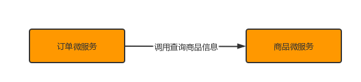

# 案例准备

## 案例准备

### 技术选型

| 技术                     | 说明            | 官网                                                   |
|------------------------|---------------|------------------------------------------------------|
| Spring Cloud           | 微服务框架         | https://spring.io/projects/spring-cloud              |
| Spring Cloud Alibaba   | 微服务框架         | https://github.com/alibaba/spring-cloud-alibaba      |
| Spring Boot            | 容器+MVC框架      | https://spring.io/projects/spring-boot               |
| Spring Security Oauth2 | 认证和授权框架       | https://spring.io/projects/spring-security-oauth     |
| MyBatis                | ORM框架         | http://www.mybatis.org/mybatis-3/zh/index.html       |
| MyBatisGenerator       | 数据层代码生成       | http://www.mybatis.org/generator/index.html          |
| PageHelper             | MyBatis物理分页插件 | http://git.oschina.net/free/Mybatis_PageHelper       |
| Knife4j                | 文档生产工具        | https://github.com/xiaoymin/swagger-bootstrap-ui     |
| Elasticsearch          | 搜索引擎          | https://github.com/elastic/elasticsearch             |
| RabbitMq               | 消息队列          | https://www.rabbitmq.com/                            |
| Redis                  | 分布式缓存         | https://redis.io/                                    |
| MongoDB                | NoSql数据库      | https://www.mongodb.com/                             |
| Docker                 | 应用容器引擎        | https://www.docker.com/                              |
| Druid                  | 数据库连接池        | https://github.com/alibaba/druid                     |
| OSS                    | 对象存储          | https://github.com/aliyun/aliyun-oss-java-sdk        |
| MinIO                  | 对象存储          | https://github.com/minio/minio                       |
| JWT                    | JWT登录支持       | https://github.com/jwtk/jjwt                         |
| LogStash               | 日志收集          | https://github.com/logstash/logstash-logback-encoder |
| Lombok                 | 简化对象封装工具      | https://github.com/rzwitserloot/lombok               |
| Seata                  | 全局事务管理框架      | https://github.com/seata/seata                       |
| Portainer              | 可视化Docker容器管理 | https://github.com/portainer/portainer               |
| Jenkins                | 自动化部署工具       | https://github.com/jenkinsci/jenkins                 |
| Kubernetes             | 应用容器管理平台      | https://kubernetes.io/                               |

### 模块设计

springcloud-alibaba 父工程
shop-common 公共模块【实体类】
shop-user 用户微服务 【端口: 807x】
shop-product 商品微服务 【端口: 808x】
shop-order 订单微服务 【端口: 809x】


### 微服务调用

在微服务架构中，最常见的场景就是微服务之间的相互调用。我们以电商系统中常见的用户下单为例来
演示微服务的调用：客户向订单微服务发起一个下单的请求，在进行保存订单之前需要调用商品微服务
查询商品的信息。
我们一般把服务的主动调用方称为服务消费者，把服务的被调用方称为服务提供者



在这种场景下，订单微服务就是一个服务消费者， 商品微服务就是一个服务提供者。

## 创建父工程

创建一个maven工程，然后在pom.xml文件中添加下面内容

```
<?xml version="1.0" encoding="UTF-8"?>
<project xmlns="http://maven.apache.org/POM/4.0.0"
         xmlns:xsi="http://www.w3.org/2001/XMLSchema-instance"
         xsi:schemaLocation="http://maven.apache.org/POM/4.0.0 http://maven.apache.org/xsd/maven-4.0.0.xsd">
    <modelVersion>4.0.0</modelVersion>

    <groupId>com.ruichen-only</groupId>
    <artifactId>springcloud-alibaba</artifactId>
    <version>1.0-SNAPSHOT</version>

    <properties>
        <maven.compiler.source>8</maven.compiler.source>
        <maven.compiler.target>8</maven.compiler.target>
        <spring-cloud.version>Hoxton.SR5</spring-cloud.version>
        <spring-cloud-alibaba.version>2.2.0.RELEASE</spring-cloud-alibaba.version>
    </properties>

    <dependencyManagement>
        <dependencies>
            <!--Spring Cloud 相关依赖-->
            <dependency>
                <groupId>org.springframework.cloud</groupId>
                <artifactId>spring-cloud-dependencies</artifactId>
                <version>${spring-cloud.version}</version>
                <type>pom</type>
                <scope>import</scope>
            </dependency>
            <!--Spring Cloud Alibaba 相关依赖-->
            <dependency>
                <groupId>com.alibaba.cloud</groupId>
                <artifactId>spring-cloud-alibaba-dependencies</artifactId>
                <version>${spring-cloud-alibaba.version}</version>
                <type>pom</type>
                <scope>import</scope>
            </dependency>
        </dependencies>
    </dependencyManagement>

</project>
```