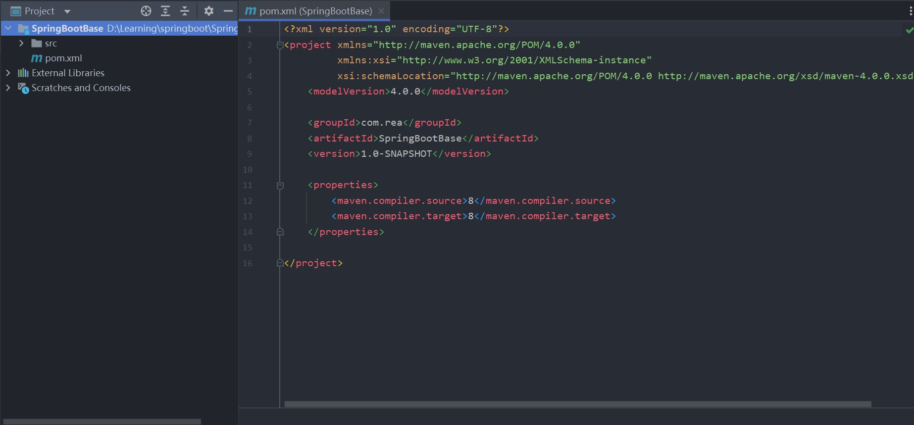

# 搭建框架基本骨架

> 基于Spring Boot + MyBatis搭建基本框架

## 项目使用框架介绍

### SpringBoot
> SpringBoot可以让你快速构建基于Spring的Web应用程序，内置多种Web容器(如Tomcat)，通过启动入口程序的main函数即可运行。

### PagerHelper

> MyBatis分页插件，简单的几行代码就能实现分页，在与SpringBoot整合时，只要整合了PagerHelper就自动整合了MyBatis。

```
PageHelper.startPage(pageNum, pageSize);
//之后进行查询操作将自动进行分页
List<PmsBrand> brandList = brandMapper.selectByExample(new PmsBrandExample());
//通过构造PageInfo对象获取分页信息，如当前页码，总页数，总条数
PageInfo<PmsBrand> pageInfo = new PageInfo<PmsBrand>(list);
```

### Druid

> alibaba开源的数据库连接池，号称Java语言中最好的数据库连接池。

### Mybatis generator

> MyBatis的代码生成器，可以根据数据库生成model、mapper.xml、mapper接口和Example，通常情况下的单表查询不用再手写mapper。

## 项目搭建

### 使用IDEA初始化一个Maven项目



## 添加项目依赖

> 在pom.xml中添加相关依赖。

```
<?xml version="1.0" encoding="UTF-8"?>
<project xmlns="http://maven.apache.org/POM/4.0.0"
         xmlns:xsi="http://www.w3.org/2001/XMLSchema-instance"
         xsi:schemaLocation="http://maven.apache.org/POM/4.0.0 http://maven.apache.org/xsd/maven-4.0.0.xsd">
    <modelVersion>4.0.0</modelVersion>

    <groupId>com.rea</groupId>
    <artifactId>SpringBootBase</artifactId>
    <version>1.0-SNAPSHOT</version>

    <parent>
        <groupId>org.springframework.boot</groupId>
        <artifactId>spring-boot-starter-parent</artifactId>
        <version>2.1.3.RELEASE</version>
        <relativePath/> <!-- lookup parent from repository -->
    </parent>

    <dependencies>
        <!--SpringBoot通用依赖模块-->
        <dependency>
            <groupId>org.springframework.boot</groupId>
            <artifactId>spring-boot-starter-web</artifactId>
        </dependency>
        <dependency>
            <groupId>org.springframework.boot</groupId>
            <artifactId>spring-boot-starter-actuator</artifactId>
        </dependency>
        <dependency>
            <groupId>org.springframework.boot</groupId>
            <artifactId>spring-boot-starter-aop</artifactId>
        </dependency>
        <dependency>
            <groupId>org.springframework.boot</groupId>
            <artifactId>spring-boot-starter-test</artifactId>
            <scope>test</scope>
        </dependency>
        <!--MyBatis分页插件-->
        <dependency>
            <groupId>com.github.pagehelper</groupId>
            <artifactId>pagehelper-spring-boot-starter</artifactId>
            <version>1.4.1</version>
        </dependency>
        <!--集成druid连接池-->
        <dependency>
            <groupId>com.alibaba</groupId>
            <artifactId>druid-spring-boot-starter</artifactId>
            <version>1.2.8</version>
        </dependency>
        <!-- MyBatis 生成器 -->
        <dependency>
            <groupId>org.mybatis.generator</groupId>
            <artifactId>mybatis-generator-core</artifactId>
            <version>1.4.0</version>
        </dependency>
        <!--Mysql数据库驱动-->
        <dependency>
            <groupId>mysql</groupId>
            <artifactId>mysql-connector-java</artifactId>
            <version>8.0.25</version>
        </dependency>
    </dependencies>
</project>
```

## 修改配置文件

> 在application.yml中添加数据源配置和MyBatis的mapper.xml的路径配置。

```yaml
server:
  port: 8080

spring:
  datasource:
    url: jdbc:mysql://localhost:3306/test?useUnicode=true&characterEncoding=utf-8&serverTimezone=Asia/Shanghai
    username: root
    password: root

mybatis:
  mapper-locations:
    - classpath:mapper/*.xml
    - classpath*:com/**/mapper/*.xml
```

## 项目结构说明

``` lua
com.rea
├── common -- 存放共通类，如工具类和通用返回结果
├── component -- 存放组件
├── config -- 存放java配置
├── controller -- 存放控制器
├── dao -- 存放自定义的mapper接口
├── dto -- 存放自定义的传输对象，如请求参数和返回结果
├── mbg
    ├── mapper 
    ├── model -- mbg的生成代码 
    ├── CommentGenerator.class 
    ├── Generator.class -- mbg代码生成器，运行即可生成代码
├── service 
    ├── impl 
├── XXXApplication -- 项目启动类
resources
├── com.rea.mbg.mapper -- mbg生成的mapper.xml文件
├── mappper -- 自定义的mapper.xml文件
├── application.yml
├── generator.properties
└── generatorConfig.xml -- 控制mbg生成代码的配置文件
```

## Mybatis generator 配置文件

> 配置数据库连接，Mybatis generator生成model、mapper接口及mapper.xml的路径。

```xml
<?xml version="1.0" encoding="UTF-8"?>
<!DOCTYPE generatorConfiguration
        PUBLIC "-//mybatis.org//DTD MyBatis Generator Configuration 1.0//EN"
        "http://mybatis.org/dtd/mybatis-generator-config_1_0.dtd">

<generatorConfiguration>
    <properties resource="generator.properties"/>
    <context id="MySqlContext" targetRuntime="MyBatis3" defaultModelType="flat">
        <property name="beginningDelimiter" value="`"/>
        <property name="endingDelimiter" value="`"/>
        <property name="javaFileEncoding" value="UTF-8"/>
        <!-- 为模型生成序列化方法-->
        <plugin type="org.mybatis.generator.plugins.SerializablePlugin"/>
        <!-- 为生成的Java模型创建一个toString方法 -->
        <plugin type="org.mybatis.generator.plugins.ToStringPlugin"/>
        <!--可以自定义生成model的代码注释-->
        <commentGenerator type="com.macro.mall.tiny.mbg.CommentGenerator">
            <!-- 是否去除自动生成的注释 true：是 ： false:否 -->
            <property name="suppressAllComments" value="true"/>
            <property name="suppressDate" value="true"/>
            <property name="addRemarkComments" value="true"/>
        </commentGenerator>
        <!--配置数据库连接-->
        <jdbcConnection driverClass="${jdbc.driverClass}"
                        connectionURL="${jdbc.connectionURL}"
                        userId="${jdbc.userId}"
                        password="${jdbc.password}">
            <!--解决mysql驱动升级到8.0后不生成指定数据库代码的问题-->
            <property name="nullCatalogMeansCurrent" value="true" />
        </jdbcConnection>
        <!--指定生成model的路径-->
        <javaModelGenerator targetPackage="com.macro.mall.tiny.mbg.model" targetProject="mall-tiny-01\src\main\java"/>
        <!--指定生成mapper.xml的路径-->
        <sqlMapGenerator targetPackage="com.macro.mall.tiny.mbg.mapper" targetProject="mall-tiny-01\src\main\resources"/>
        <!--指定生成mapper接口的的路径-->
        <javaClientGenerator type="XMLMAPPER" targetPackage="com.macro.mall.tiny.mbg.mapper"
                             targetProject="mall-tiny-01\src\main\java"/>
        <!--生成全部表tableName设为%-->
        <table tableName="pms_brand">
            <generatedKey column="id" sqlStatement="MySql" identity="true"/>
        </table>
    </context>
</generatorConfiguration>
```