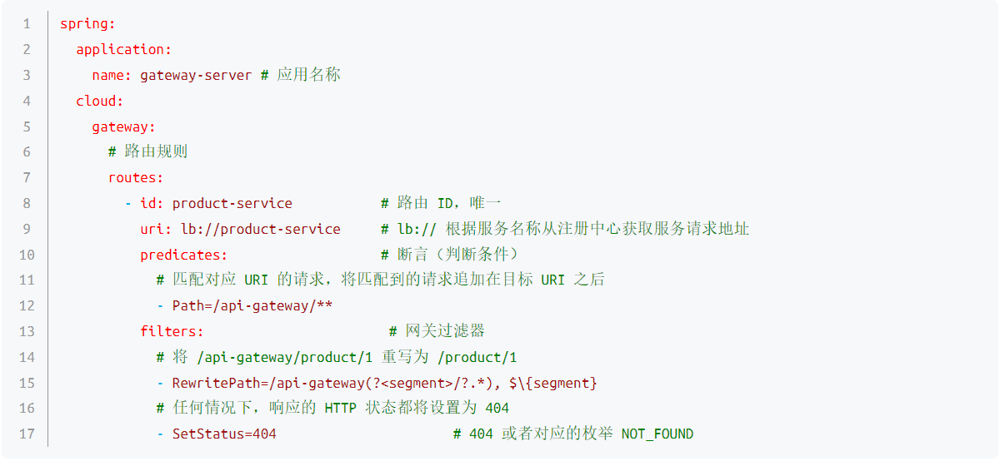

# Gateway--服务网关

##  网关简介

大家都都知道在微服务架构中，一个系统会被拆分为很多个微服务。那么作为客户端要如何去调用这么
多的微服务呢？如果没有网关的存在，我们只能在客户端记录每个微服务的地址，然后分别去调用。


这样的架构，会存在着诸多的问题：
* 客户端多次请求不同的微服务，增加客户端代码或配置编写的复杂性
* 认证复杂，每个服务都需要独立认证。
* 存在跨域请求，在一定场景下处理相对复杂。

上面的这些问题可以借助**API网关**来解决。
所谓的API网关，就是指系统的**统一入口**，它封装了应用程序的内部结构，为客户端提供统一服务，一
些与业务本身功能无关的公共逻辑可以在这里实现，诸如认证、鉴权、监控、路由转发等等。
添加上API网关之后，系统的架构图变成了如下所示：


**我们也可以观察下，我们现在的整体架构图**


流行的网关比较

| |spring cloud gateway| zuul|
|--|---|---|
| 性能|性能比zuul好将近一倍| zuul1性能较差，zuul2较1有较大的提升|
| 社区和文档|spring社区非常活跃| 一般|
| 可维护性|基于spring官方维护性强| 经常跳票，spring cloud暂时还没有对zuul2的整合计划|
| 亮点|异步，配置灵活| 成熟，简单门槛低|
| 不足|早期产品，新版本踩坑| 性能一般，可编程一般|

> SpringCloud alibaba技术栈中并没有提供自己的网关，我们可以采用Spring Cloud Gateway来做网关

## Gateway简介

spring Cloud Gateway是Spring公司基于Spring 5.0，Spring Boot 2.0 和 Project Reactor 等技术开发
的网关，它旨在为微服务架构提供一种简单有效的统一的 API 路由管理方式。它的目标是替代Netflix
Zuul，其不仅提供统一的路由方式，并且基于 Filter 链的方式提供了网关基本的功能，例如：安全，监
控和限流。

**优点**：
* **性能强劲**：是第一代网关Zuul的1.6倍
* **功能强大**：内置了很多实用的功能，例如转发、监控、限流等
* **设计优雅**，容易扩展

缺点：
* 其实现依赖Netty与WebFlux，不是传统的Servlet编程模型，学习成本高
* 不能将其部署在Tomcat、Jetty等Servlet容器里，只能打成jar包执行
* 需要Spring Boot 2.0及以上的版本，才支持

## Gateway快速入门

要求: 通过浏览器访问api网关,然后通过网关将请求转发到商品微服务

### 整合项目

1. 修改pom文件，引入依赖

```xml
<?xml version="1.0" encoding="UTF-8"?>
<project xmlns="http://maven.apache.org/POM/4.0.0"
         xmlns:xsi="http://www.w3.org/2001/XMLSchema-instance"
         xsi:schemaLocation="http://maven.apache.org/POM/4.0.0 http://maven.apache.org/xsd/maven-4.0.0.xsd">
    <parent>
        <artifactId>practical</artifactId>
        <groupId>com.rea</groupId>
        <version>1.0-SNAPSHOT</version>
    </parent>
    <modelVersion>4.0.0</modelVersion>

    <artifactId>gateway</artifactId>

    <dependencies>
        <!--GateWay 网关-->
        <dependency>
            <groupId>org.springframework.cloud</groupId>
            <artifactId>spring-cloud-starter-gateway</artifactId>
        </dependency>
    </dependencies>

</project>
```

2. 创建主类

```java
package com.rea.gateway;

import org.springframework.boot.SpringApplication;
import org.springframework.boot.autoconfigure.SpringBootApplication;
import org.springframework.cloud.client.discovery.EnableDiscoveryClient;

/**
 * 启动网关服务入口。
 * @author CRR
 */
@SpringBootApplication
@EnableDiscoveryClient
public class GatewayApplication {
    public static void main(String[] args) {
        SpringApplication.run(GatewayApplication.class, args);
    }
}
```

3. 添加配置文件

增加application.yml文件

```yaml
server:
  port: 8008

```

增加bootstrap.yml文件

```yaml
spring:
  profiles:
    active: dev
  application:
    name: shop-gateway
  cloud:
    gateway:
      routes:
        - id: product  # 当前路由的标识, 要求唯一
          uri: lb://shop-product # 请求要转发到的地址
          order: 1 # 路由的优先级,数字越小级别越高
          predicates:
            - Path=/product/**  # 当请求路径满足Path指定的规则时,才进行路由转发
          filters:
            - StripPrefix=1
```

增加bootstrap-dev.yml文件

```yaml
spring:
  cloud:
    nacos:
      discovery:
        server-addr: 127.0.0.1:8848
        namespace: dfa414fe-6383-45bc-9a31-803a9c475c57
```

4. 启动项目, 并通过网关去访问微服务

浏览器访问：[http://localhost:8008/product/getProduct?pid=1](http://localhost:8008/product/getProduct?pid=1)
可以看到请求被转发到了商品服务

## Gateway核心架构

### 基本概念

路由(Route) 是 gateway 中最基本的组件之一，表示一个具体的路由信息载体。主要定义了下面的几个信息:

* **id**，路由标识符，区别于其他 Route。
* **uri**，路由指向的目的地 uri，即客户端请求最终被转发到的微服务。
* **order**，用于多个 Route 之间的排序，数值越小排序越靠前，匹配优先级越高。
* **predicate**，断言的作用是进行条件判断，只有断言都返回真，才会真正地执行路由。
* **filter**，过滤器用于修改请求和响应信息。

### 执行流程


执行流程大体如下：

1. Gateway Client向Gateway Server发送请求
2. 请求首先会被HttpWebHandlerAdapter进行提取组装成网关上下文
3. 然后网关的上下文会传递到DispatcherHandler，它负责将请求分发给RoutePredicateHandlerMapping
4. RoutePredicateHandlerMapping负责路由查找，并根据路由断言判断路由是否可用
5. 如果过断言成功，由FilteringWebHandler创建过滤器链并调用
6. 请求会一次经过PreFilter--微服务-PostFilter的方法，最终返回响应

## 路由规则


* Path


请求 http://localhost:9000/product/1 将会路由至 http://localhost:7070/product/1

* Query


Query=token：比如，http://localhost:9000/product/1?token=123
Query=token, abc.：比如，http://localhost:9000/product/1?token=abc1

* Method


* DateTime


* RemoteAddr


RemoteAddr=192.168.10.1/0：比如，http://192.168.10.1:9000/product/1


## 过滤器

Spring Cloud Gateway 根据作用范围划分为 GatewayFilter 和 GlobalFilter，二者区别如下：

**GatewayFilter：网关过滤器**，需要通过 spring.cloud.routes.filters 配置在具体路由下，只作用在当前路由上或通过 spring.cloud.default-filters 配置在全局，作用在所有路由上。

**GlobalFilter：全局过滤器**，不需要在配置文件中配置，作用在所有的路由上，最终通过 GatewayFilterAdapter 包装成 GatewayFilterChain 可识别的过滤器，它为请求业务以及路由的 URI 转换为真实业务服务请求地址的核心过滤器，不需要配置系统初始化时加载，并作用在每个路由上。

* 网关过滤器

网关过滤器用于拦截并链式处理 Web 请求，可以实现横切与应用无关的需求，比如：安全、访问超时的设置等。修改传入的 HTTP 请求或传出 HTTP 响应。Spring Cloud Gateway 包含许多内置的网关过滤器工厂一共有 22 个，包括头部过滤器、 路径类过滤器、Hystrix 过滤器和重写请求 URL 的过滤器， 还有参数和状态码等其他类型的过滤器。根据过滤器工厂的用途来划分，可以分为以下几种：Header、Parameter、Path、Body、Status、Session、Redirect、Retry、RateLimiter 和 Hystrix。

* Path路径过滤器

RewritePath 网关过滤器工厂采用路径正则表达式参数和替换参数，使用 Java 正则表达式来灵活地重写请求路径。


PrefixPath 网关过滤器工厂为匹配的 URI 添加指定前缀。


StripPrefix 网关过滤器工厂采用一个参数 StripPrefix，该参数表示在将请求发送到下游之前从请求中剥离的路径个数。


SetPath 网关过滤器工厂采用路径模板参数。
它提供了一种通过允许模板化路径段来操作请求路径的简单方法，使用了 Spring Framework 中的 uri 模板，允许多个匹配段。


AddRequestParameter 网关过滤器工厂

会将指定参数添加至匹配到的下游请求中。

SetStatus 网关过滤器工厂采用单个状态参数，它必须是有效的 Spring HttpStatus。它可以是整数 404 或枚举 NOT_FOUND 的字符串表示。



* 全局过滤器

全局过滤器不需要在配置文件中配置，作用在所有的路由上，最终通过 GatewayFilterAdapter 包装成 GatewayFilterChain 可识别的过滤器，它是请求业务以及路由的 URI 转换为真实业务服务请求地址的核心过滤器，不需要配置系统初始化时加载，并作用在每个路由上。


* 自定义过滤器

即使 Spring Cloud Gateway 自带许多实用的 GatewayFilter Factory、Gateway Filter、Global Filter，但是在很多情景下我们仍然希望可以自定义自己的过滤器，实现一些骚操作。

自定义网关过滤器需要实现以下两个接口 ：GatewayFilter，Ordered

```java
package com.example.filter;

import org.springframework.cloud.gateway.filter.GatewayFilter;
import org.springframework.cloud.gateway.filter.GatewayFilterChain;
import org.springframework.core.Ordered;
import org.springframework.web.server.ServerWebExchange;
import reactor.core.publisher.Mono;

/**
 * 自定义网关过滤器
 */
public class CustomGatewayFilter implements GatewayFilter, Ordered {

    /**
     * 过滤器业务逻辑
     *
     * @param exchange
     * @param chain
     * @return
     */
    @Override
    public Mono<Void> filter(ServerWebExchange exchange, GatewayFilterChain chain) {
        System.out.println("自定义网关过滤器被执行");
        return chain.filter(exchange); // 继续向下执行
    }

    /**
     * 过滤器执行顺序，数值越小，优先级越高
     *
     * @return
     */
    @Override
    public int getOrder() {
        return 0;
    }
}

```

注册过滤器
```java
package com.example.config;

import com.example.filter.CustomGatewayFilter;
import org.springframework.cloud.gateway.route.RouteLocator;
import org.springframework.cloud.gateway.route.builder.RouteLocatorBuilder;
import org.springframework.context.annotation.Bean;
import org.springframework.context.annotation.Configuration;

/**
 * 网关路由配置类
 */
@Configuration
public class GatewayRoutesConfiguration {

    @Bean
    public RouteLocator routeLocator(RouteLocatorBuilder builder) {
        return builder.routes().route(r -> r
                // 断言（判断条件）
                .path("/product/**")
                // 目标 URI，路由到微服务的地址
                .uri("lb://product-service")
                // 注册自定义网关过滤器
                .filters(new CustomGatewayFilter())
                // 路由 ID，唯一
                .id("product-service"))
                .build();
    }

}

```

自定义全局过滤器需要实现以下两个接口 ：GlobalFilter，Ordered。通过全局过滤器可以实现权限校验，安全性验证等功能。
实现指定接口，添加 @Component 注解即可。

```java
package com.example.filter;

import org.springframework.cloud.gateway.filter.GatewayFilterChain;
import org.springframework.cloud.gateway.filter.GlobalFilter;
import org.springframework.core.Ordered;
import org.springframework.stereotype.Component;
import org.springframework.web.server.ServerWebExchange;
import reactor.core.publisher.Mono;

/**
 * 自定义全局过滤器
 */
@Component
public class CustomGlobalFilter implements GlobalFilter, Ordered {

    /**
     * 过滤器业务逻辑
     *
     * @param exchange
     * @param chain
     * @return
     */
    @Override
    public Mono<Void> filter(ServerWebExchange exchange, GatewayFilterChain chain) {
        System.out.println("自定义全局过滤器被执行");
        return chain.filter(exchange); // 继续向下执行
    }

    /**
     * 过滤器执行顺序，数值越小，优先级越高
     *
     * @return
     */
    @Override
    public int getOrder() {
        return 0;
    }
}

```

## 网关限流

网关是所有请求的公共入口，所以可以在网关进行限流，而且限流的方式也很多，我们本次采用前面学
过的Sentinel组件来实现网关的限流。Sentinel支持对SpringCloud Gateway、Zuul等主流网关进行限
流。

从1.6.0版本开始，Sentinel提供了SpringCloud Gateway的适配模块，可以提供两种资源维度的限流：

* route维度：即在Spring配置文件中配置的路由条目，资源名为对应的routeId
* 自定义API维度：用户可以利用Sentinel提供的API来自定义一些API分组

1. 导入依赖

```xml
<dependency>
    <groupId>com.alibaba.csp</groupId>
    <artifactId>sentinel-spring-cloud-gateway-adapter</artifactId>
</dependency>
```

2. 编写配置类

基于Sentinel 的Gateway限流是通过其提供的Filter来完成的，使用时只需注入对应的
SentinelGatewayFilter实例以及 SentinelGatewayBlockExceptionHandler 实例即可。

```java

package com.rea.gateway.config;

import com.alibaba.csp.sentinel.adapter.gateway.common.rule.GatewayFlowRule;
import com.alibaba.csp.sentinel.adapter.gateway.common.rule.GatewayRuleManager;
import com.alibaba.csp.sentinel.adapter.gateway.sc.SentinelGatewayFilter;
import com.alibaba.csp.sentinel.adapter.gateway.sc.callback.BlockRequestHandler;
import com.alibaba.csp.sentinel.adapter.gateway.sc.callback.GatewayCallbackManager;
import com.alibaba.csp.sentinel.adapter.gateway.sc.exception.SentinelGatewayBlockExceptionHandler;
import org.springframework.beans.factory.ObjectProvider;
import org.springframework.cloud.gateway.filter.GlobalFilter;
import org.springframework.context.annotation.Bean;
import org.springframework.context.annotation.Configuration;
import org.springframework.core.Ordered;
import org.springframework.core.annotation.Order;
import org.springframework.http.HttpStatus;
import org.springframework.http.MediaType;
import org.springframework.http.codec.ServerCodecConfigurer;
import org.springframework.web.reactive.function.BodyInserters;
import org.springframework.web.reactive.function.server.ServerResponse;
import org.springframework.web.reactive.result.view.ViewResolver;
import org.springframework.web.server.ServerWebExchange;
import reactor.core.publisher.Mono;

import javax.annotation.PostConstruct;
import java.util.*;

/**
 * @author CRR
 */
@Configuration
public class GatewayConfiguration {

    private final List<ViewResolver> viewResolvers;
    private final ServerCodecConfigurer serverCodecConfigurer;

    public GatewayConfiguration(ObjectProvider<List<ViewResolver>> viewResolversProvider,
                                ServerCodecConfigurer serverCodecConfigurer) {
        this.viewResolvers = viewResolversProvider.getIfAvailable(Collections::emptyList);
        this.serverCodecConfigurer = serverCodecConfigurer;
    }

    /**
     * 初始化一个限流的过滤器
     * @return
     */
    @Bean
    public GlobalFilter sentinelGatewayFilter() {
        return new SentinelGatewayFilter();
    }

    /**
     * 配置初始化的限流参数
     */
    @PostConstruct
    public void initGatewayRules() {
        Set<GatewayFlowRule> rules = new HashSet<>();

        //资源名称,对应路由id
        rules.add(new GatewayFlowRule("shop-product")
                          // 限流阈值
                          .setCount(1)
                          // 统计时间窗口，单位是秒，默认是 1 秒
                          .setIntervalSec(1));
        GatewayRuleManager.loadRules(rules);
    }

    /**
     * 配置限流的异常处理器
     * @return
     */
    @Bean
    @Order(Ordered.HIGHEST_PRECEDENCE)
    public SentinelGatewayBlockExceptionHandler sentinelGatewayBlockExceptionHandler() {
        return new SentinelGatewayBlockExceptionHandler(viewResolvers,
                                                        serverCodecConfigurer);
    }

    /**
     * 自定义限流异常页面
     */
    @PostConstruct
    public void initBlockHandlers() {
        BlockRequestHandler requestHandler = new BlockRequestHandler() {
            @Override
            public Mono<ServerResponse> handleRequest(ServerWebExchange serverWebExchange,
                                                      Throwable throwable) {
                Map<String, Object> map = new HashMap<>(16);
                map.put("code", 0);
                map.put("message", "接口被限流了");

                return ServerResponse.status(HttpStatus.OK)
                                     .contentType(MediaType.APPLICATION_JSON)
                                     .body(BodyInserters.fromValue(map));
            }
        };
        GatewayCallbackManager.setBlockHandler(requestHandler);
    }
}

```

3. 测试

在一秒钟内多次访问[http://localhost:8008/product/getProduct?pid=1](http://localhost:8008/product/getProduct?pid=1)就可以看到限流启作用了。


