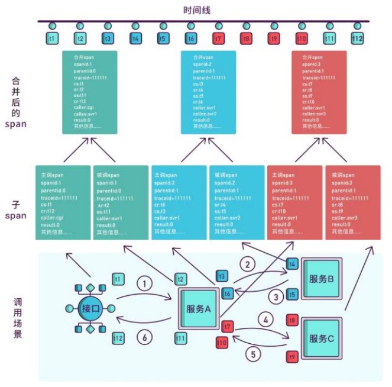

# 微服务架构介绍

> 微服务架构， 简单的说就是将单体应用进一步拆分，拆分成更小的服务，每个服务都是一个可以独立运
行的项目。

## 微服务架构的常见问题
> 一旦采用微服务系统架构，就势必会遇到这样几个问题：

- 这么多小服务，如何管理他们？(服务治理 注册中心[服务注册 发现 剔除])
- 这么多小服务，他们之间如何通讯？(restful rpc)
- 这么多小服务，客户端怎么访问他们？(网关)
- 这么多小服务，一旦出现问题了，应该如何自处理？(容错)
- 这么多小服务，一旦出现问题了，应该如何排错? (链路追踪)

对于上面的问题，是任何一个微服务设计者都不能绕过去的，因此大部分的微服务产品都针对每一个问
题提供了相应的组件来解决它们。

## 微服务架构的常见概念

### 服务治理

> 服务治理就是进行服务的自动化管理，其核心是服务的自动注册与发现。

**服务注册**：服务实例将自身服务信息注册到注册中心。  
**服务发现**：服务实例通过注册中心，获取到注册到其中的服务实例的信息，通过这些信息去请求它们提
供的服务。  
**服务剔除**：服务注册中心将出问题的服务自动剔除到可用列表之外，使其不会被调用到。

### 服务调用
> 在微服务架构中，通常存在多个服务之间的远程调用的需求。目前主流的远程调用技术有基于HTTP的
RESTful接口以及基于TCP的RPC协议。

- REST(Representational State Transfer)：这是一种HTTP调用的格式，更标准，更通用，无论哪种语言都支持http协议
- RPC（Remote Promote Call）：一种进程间通信方式。允许像调用本地服务一样调用远程服务。
  RPC框架的主要目标就是让远程服务调用更简单、透明。RPC框架负责屏蔽底层的传输方式、序列
  化方式和通信细节。开发人员在使用的时候只需要了解谁在什么位置提供了什么样的远程服务接口
  即可，并不需要关心底层通信细节和调用过程。

**区别与联系**

| 比较项  | RESTful | RPC     |
|------|---------|---------|
| 通讯协议 | HTTP    | 一般使用TCP |
| 性能   | 略低      | 较高      |
| 灵活度  | 高       | 较高      |
| 应用   | 微服务架构   | SOA架构   |

### 服务网关

随着微服务的不断增多，不同的微服务一般会有不同的网络地址，而外部客户端可能需要调用多个服务
的接口才能完成一个业务需求，如果让客户端直接与各个微服务通信可能出现：

- 客户端需要调用不同的url地址，增加难度
- 在一定的场景下，存在跨域请求的问题
- 每个微服务都需要进行单独的身份认证

针对这些问题，API网关顺势而生。

API网关直面意思是将所有API调用统一接入到API网关层，由网关层统一接入和输出。一个网关的基本
功能有：统一接入、安全防护、协议适配、流量管控、长短链接支持、容错能力。有了网关之后，各个
API服务提供团队可以专注于自己的的业务逻辑处理，而API网关更专注于安全、流量、路由等问题。

### 服务容错

> 在微服务当中，一个请求经常会涉及到调用几个服务，如果其中某个服务不可用，没有做服务容错的
话，极有可能会造成一连串的服务不可用，这就是雪崩效应。我们没法预防雪崩效应的发生，只能尽可
能去做好容错。服务容错的三个核心思想是：

- 不被外界环境影响
- 不被上游请求压垮
- 不被下游响应拖垮

### 链路追踪

随着微服务架构的流行，服务按照不同的维度进行拆分，一次请求往往需要涉及到多个服务。互联网应
用构建在不同的软件模块集上，这些软件模块，有可能是由不同的团队开发、可能使用不同的编程语言
来实现、有可能布在了几千台服务器，横跨多个不同的数据中心。因此，就需要对一次请求涉及的多个
服务链路进行日志记录，性能监控即链路追踪

## 微服务架构的常见解决方案

### ServiceComb

Apache ServiceComb，前身是华为云的微服务引擎 CSE (Cloud Service Engine) 云服务，是全球首个
Apache微服务顶级项目。它提供了一站式的微服务开源解决方案，致力于帮助企业、用户和开发者将
企业应用轻松微服务化上云，并实现对微服务应用的高效运维管理。

### SpringCloud

Spring Cloud是一系列框架的集合。它利用Spring Boot的开发便利性巧妙地简化了分布式系统基础设
施的开发，如服务发现注册、配置中心、消息总线、负载均衡、断路器、数据监控等，都可以用Spring
Boot的开发风格做到一键启动和部署。
Spring Cloud并没有重复制造轮子，它只是将目前各家公司开发的比较成熟、经得起实际考验的服务框
架组合起来，通过Spring Boot风格进行再封装屏蔽掉了复杂的配置和实现原理，最终给开发者留出了
一套简单易懂、易部署和易维护的分布式系统开发工具包。

### SpringCloud Alibaba

Spring Cloud Alibaba 致力于提供微服务开发的一站式解决方案。此项目包含开发分布式应用微服务的
必需组件，方便开发者通过 Spring Cloud 编程模型轻松使用这些组件来开发分布式应用服务。