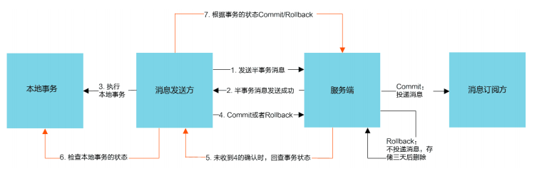

# Rocketmq--消息驱动

## 什么是MQ

MQ（Message Queue）是一种跨进程的通信机制，用于传递消息。通俗点说，就是一个先进先出的数
据结构。


## MQ的应用场景

### 异步解耦

最常见的一个场景是用户注册后，需要发送注册邮件和短信通知，以告知用户注册成功。传统的做法如下：


此架构下注册、邮件、短信三个任务全部完成后，才返回注册结果到客户端，用户才能使用账号登录。
但是对于用户来说，注册功能实际只需要注册系统存储用户的账户信息后，该用户便可以登录，而后续
的注册短信和邮件不是即时需要关注的步骤。
所以实际当数据写入注册系统后，注册系统就可以把其他的操作放入对应的消息队列 MQ 中然后马上返
回用户结果，由消息队列 MQ 异步地进行这些操作。架构图如下：


异步解耦是消息队列 MQ 的主要特点，主要目的是减少请求响应时间和解耦。主要的使用场景就是将**比
较耗时而且不需要即时（同步）**返回结果的操作作为消息放入消息队列。同时，由于使用了消息队列
MQ，只要保证消息格式不变，消息的发送方和接收方并不需要彼此联系，也不需要受对方的影响，即
解耦合。

### 流量削峰

流量削峰也是消息队列 MQ 的常用场景，一般在秒杀或团队抢购(高并发)活动中使用广泛。在秒杀或团
队抢购活动中，由于用户请求量较大，导致流量暴增，秒杀的应用在处理如此大量的访问流量后，下游
的通知系统无法承载海量的调用量，甚至会导致系统崩溃等问题而发生漏通知的情况。为解决这些问
题，可在应用和下游通知系统之间加入消息队列 MQ。


秒杀处理流程如下所述：
1. 用户发起海量秒杀请求到秒杀业务处理系统。
2. 秒杀处理系统按照秒杀处理逻辑将满足秒杀条件的请求发送至消息队列 MQ。
3. 下游的通知系统订阅消息队列 MQ 的秒杀相关消息，再将秒杀成功的消息发送到相应用户。
4. 用户收到秒杀成功的通知。

## 常见的MQ产品

| MQ产品     | 说明                                                                                                                          |
|----------|-----------------------------------------------------------------------------------------------------------------------------|
| ZeroMQ   | 号称最快的消息队列系统，尤其针对大吞吐量的需求场景。扩展性好，开发比较灵活，采用C语言实现，实际上只是一个socket库的重新封装，如果做为消息队列使用，需要开发大量的代码。ZeroMQ仅提供非持久性的队列，也就是说如果down机，数据将会丢失。 |
| RabbitMQ | 使用erlang语言开发，性能较好，适合于企业级的开发。但是不利于做二次开发和维护。                                                                                  |
| ActiveMQ | 历史悠久的Apache开源项目。已经在很多产品中得到应用，实现了JMS1.1规范，可以和spring-jms轻松融合，实现了多种协议，支持持久化到数据库，对队列数较多的情况支持不好。                                 |
| RocketMQ | 阿里巴巴的MQ中间件，由java语言开发，性能非常好，能够撑住双十一的大流量，而且使用起来很简单。                                                                           |
| Kafka    | Kafka是Apache下的一个子项目，是一个高性能跨语言分布式Publish/Subscribe消息队列系统，相对于ActiveMQ是一个非常轻量级的消息系统，除了性能非常好之外，还是一个工作良好的分布式系统。                  |

## RocketMQ的架构及概念


> 如上图所示，整体可以分成4个角色，分别是：NameServer，Broker，Producer，Consumer。

* **Broker（邮递员）**：Broker是RocketMQ的核心，负责消息的接收，存储，投递等功能
* **NameServer（邮局）**：消息队列的协调者，Broker向它注册路由信息，同时Producer和Consumer
  向其获取路由信息Producer(寄件人)消息的生产者，需要从NameServer获取Broker信息，然后与
  Broker建立连接，向Broker发送消息
* **Consumer（收件人）** ：消息的消费者，需要从NameServer获取Broker信息，然后与Broker建立连
  接，从Broker获取消息
* **Topic（地区）**：用来区分不同类型的消息，发送和接收消息前都需要先创建Topic，针对Topic来发送
  和接收消息Message Queue(邮件)为了提高性能和吞吐量，引入了Message Queue，一个Topic可
  以设置一个或多个Message Queue，这样消息就可以并行往各个Message Queue发送消息，消费
  者也可以并行的从多个Message Queue读取消息
* **Message**：Message 是消息的载体。
* **ProducerGroup**：生产者组，简单来说就是多个发送同一类消息的生产者称之为一个生产者组。
* **ConsumerGroup**：消费者组，消费同一类消息的多个 consumer 实例组成一个消费者组。

## RocketMQ入门

### Windows下RocketMQ的安装

1. 下载RocketMQ  
  [http://rocketmq.apache.org/release_notes/](http://rocketmq.apache.org/release_notes/)  
  选择自己需要的版本，这里选择4.9.2版本  
  
   
2. 解压缩 
   
3. RocketMQ配置系统变量  
```text
系统变量名： ROCKETMQ_HOME
系统变量值： D:\RocketMQ\rocketmq-4.9.2（自己的mq解压目录）
```
4. 启动
   * 双击mqnamesrv.cmd运行
   * 解压后进入bin目录，在地址栏输入cmd进入命令框，输入以下命令
   
```shell
start mqbroker.cmd -n 127.0.0.1:9876 autoCreateTopicEnable=true
```


### RocketMQ插件部署

1. 下载控制台
    [https://github.com/apache/rocketmq-dashboard](https://github.com/apache/rocketmq-dashboard)
2. 下载完成后进入解压目录的rocketmq-console项目  
   找到application.properties配置文件

```properties
server.address=0.0.0.0
server.port=8080
rocketmq.config.namesrvAddr=127.0.0.1:9876
```

3. 配置完成后，cmd进入rocketmq-console项目根目录，使用maven打包

```shell
mvn clean package -Dmaven.test.skip=true
```

4. 打包成功后，target目录下会生成rocketmq-console-ng-1.0.0.jar，使用java -jar命令运行这个jar包

```shell
java -jar rocketmq-dashboard-1.0.1-SNAPSHOT.jar
```

5. 访问rocketmq监控页面[http://localhost:8888](http://localhost:8888)


## 模拟案例

接下来我们模拟一种场景: 下单成功之后，向下单用户发送短信。设计图如下：


### 订单微服务发送消息

1. 在 shop-order 中添加rocketmq的依赖

```xml
<!--消息队列 RocketMQ 依赖-->
<dependency>
    <groupId>org.apache.rocketmq</groupId>
    <artifactId>rocketmq-spring-boot-starter</artifactId>
    <version>2.2.0</version>
</dependency>
```

2. 在 bootstrap-dev.yml文件中增加配置

```yaml
rocketmq:
  name-server: localhost:9876
  producer: 
    group: test-group
```

3. 启动订单微服务
4. 浏览器中输入：http://localhost:8011/order?pid=1


5. 消息发送成功后，可以到RocketMQ的控制台中进行查看


### 用户微服务订阅消息

1. 在 shop-user 中添加rocketmq的依赖

```xml
<!--消息队列 RocketMQ 依赖-->
<dependency>
    <groupId>org.apache.rocketmq</groupId>
    <artifactId>rocketmq-spring-boot-starter</artifactId>
    <version>2.2.0</version>
</dependency>
```

2. 在 bootstrap-dev.yml文件中增加配置

```yaml
rocketmq:
  name-server: localhost:9876
  producer: 
    group: test-group
```

3. com.rea.user.service.impl包下创建服务类MessageServiceImpl

```java
package com.rea.user.service.impl;

import com.alibaba.fastjson.JSON;
import com.rea.mbg.model.ShopOrder;
import lombok.extern.slf4j.Slf4j;
import org.apache.rocketmq.spring.annotation.RocketMQMessageListener;
import org.apache.rocketmq.spring.core.RocketMQListener;
import org.springframework.stereotype.Component;

/**
 * @author CRR
 */
@Slf4j
@Component
@RocketMQMessageListener(topic = "order-topic", consumerGroup = "test-group")
public class MessageServiceImpl implements RocketMQListener<ShopOrder> {

    @Override
    public void onMessage(ShopOrder shopOrder) {
        log.info("发送下单邮件成功：" + JSON.toJSONString(shopOrder));
    }
}

```

4. 启动user服务

因为之前已经成发送消息，所以在启动时，控制台log中出现消息


##  发送不同类型的消息

### 普通消息

RocketMQ提供三种方式来发送普通消息：可靠同步发送、可靠异步发送和单向发送。

**可靠同步发送**

> 同步发送是指消息发送方发出数据后，会在收到接收方发回响应之后才发下一个数据包的通讯方
式。
> 此种方式应用场景非常广泛，例如重要通知邮件、报名短信通知、营销短信系统等。

**可靠异步发送**

> 异步发送是指发送方发出数据后，不等接收方发回响应，接着发送下个数据包的通讯方式。发送
方通过回调接口接收服务器响应，并对响应结果进行处理。
> 
> 异步发送一般用于链路耗时较长，对 RT 响应时间较为敏感的业务场景，例如用户视频上传后通知
启动转码服务，转码完成后通知推送转码结果等。

**单向发送**

> 单向发送是指发送方只负责发送消息，不等待服务器回应且没有回调函数触发，即只发送请求不
等待应答。
> 
> 适用于某些耗时非常短，但对可靠性要求并不高的场景，例如日志收集。

三种发送方式的对比

| 发送方式 | 发送 TPS | 发送结果反馈 | 可靠性 |
|------|--------|--------|-----|
| 同步发送 | 快      | 有      | 不丢失 |
| 异步发送 | 快      | 有      | 不丢失 |
| 单向发送 | 最快     | 无      | 不丢失 |

### 顺序消息

顺序消息是消息队列提供的一种严格按照顺序来发布和消费的消息类型


### 事务消息

RocketMQ提供了事务消息，通过事务消息就能达到分布式事务的最终一致。

**事务消息交互流程:**



**两个概念:**

半事务消息：暂不能投递的消息，发送方已经成功地将消息发送到了RocketMQ服务端，但是服务端未
收到生产者对该消息的二次确认，此时该消息被标记成“暂不能投递”状态，处于该种状态下的消息即半
事务消息。

消息回查：由于网络闪断、生产者应用重启等原因，导致某条事务消息的二次确认丢失，RocketMQ服
务端通过扫描发现某条消息长期处于“半事务消息”时，需要主动向消息生产者询问该消息的最终状态
（Commit 或是 Rollback），该询问过程即消息回查。

**事务消息发送步骤：**

1. 发送方将半事务消息发送至RocketMQ服务端。
2. RocketMQ服务端将消息持久化之后，向发送方返回Ack确认消息已经发送成功，此时消息为半事务消息。
3. 发送方开始执行本地事务逻辑。
4. 发送方根据本地事务执行结果向服务端提交二次确认（Commit 或是 Rollback），服务端收到
   Commit 状态则将半事务消息标记为可投递，订阅方最终将收到该消息；服务端收到 Rollback 状
   态则删除半事务消息，订阅方将不会接受该消息。

**事务消息回查步骤：**

1. 在断网或者是应用重启的特殊情况下，上述步骤4提交的二次确认最终未到达服务端，经过固定时
   间后服务端将对该消息发起消息回查。
2. 发送方收到消息回查后，需要检查对应消息的本地事务执行的最终结果。
3. 发送方根据检查得到的本地事务的最终状态再次提交二次确认，服务端仍按照步骤4对半事务消息进行操作。

## 消息消费要注意的细节

```java
@RocketMQMessageListener(
        consumerGroup = "shop",
        //消费者分组 
        topic = "order-topic",
        //要消费的主题 
        consumeMode = ConsumeMode.CONCURRENTLY, 
        //消费模式:无序和有序 
        messageModel = MessageModel.CLUSTERING
        //消息模式:广播和集群,默认是集群 
)
public class SmsService implements RocketMQListener<Order> {}
```

RocketMQ支持两种消息模式:
* **广播消费**: 每个消费者实例都会收到消息,也就是一条消息可以被每个消费者实例处理；
* **集群消费**: 一条消息只能被一个消费者实例消费
