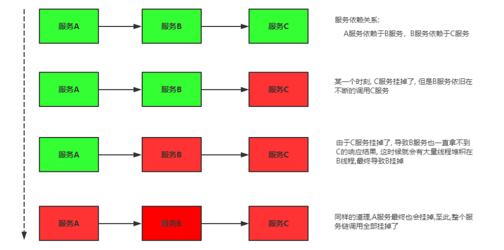
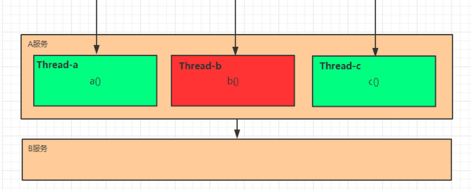
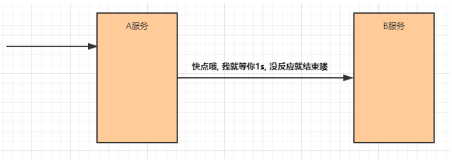
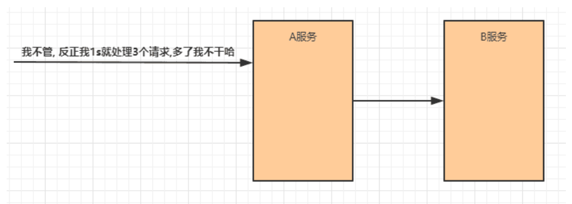
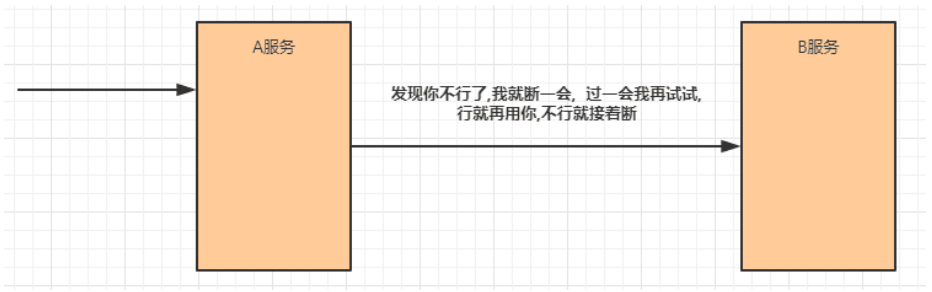
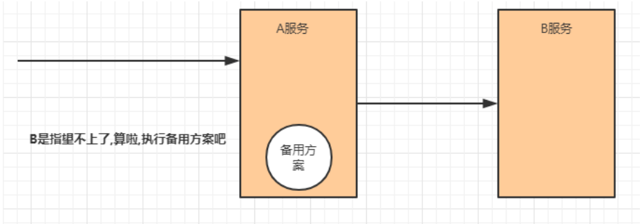
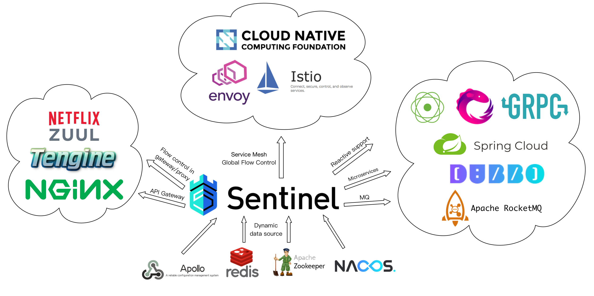
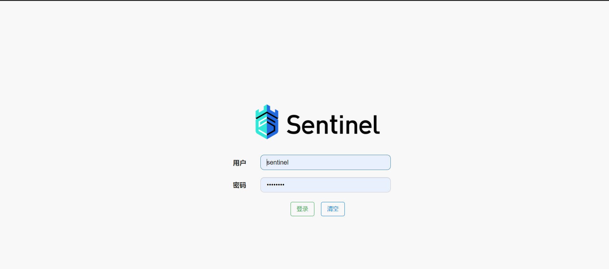

# Sentinel--服务容错

## 服务降级

### 高并发带来的问题

在微服务架构中，我们将业务拆分成一个个的服务，服务与服务之间可以相互调用，但是由于网络原因
或者自身的原因，服务并不能保证服务的100%可用，如果单个服务出现问题，调用这个服务就会出现
网络延迟，此时若有大量的网络涌入，会形成任务堆积，最终导致服务瘫痪。

### 服务雪崩效应

在分布式系统中,由于网络原因或自身的原因,服务一般无法保证 100% 可用。如果一个服务出现了问
题，调用这个服务就会出现线程阻塞的情况，此时若有大量的请求涌入，就会出现多条线程阻塞等待，
进而导致服务瘫痪。
由于服务与服务之间的依赖性，故障会传播，会对整个微服务系统造成灾难性的严重后果，这就是服务
故障的 “**雪崩效应**” 。



雪崩发生的原因多种多样，有不合理的容量设计，或者是高并发下某一个方法响应变慢，亦或是某台机
器的资源耗尽。我们无法完全杜绝雪崩源头的发生，只有做好足够的容错，保证在一个服务发生问题，
不会影响到其它服务的正常运行。也就是＂雪落而不雪崩＂。

### 常见容错方案

要防止雪崩的扩散，我们就要做好服务的容错，容错说白了就是保护自己不被猪队友拖垮的一些措施,
下面介绍常见的服务容错思路和组件。

> 常见的容错思路

常见的容错思路有隔离、超时、限流、熔断、降级这几种，下面分别介绍一下。

* 隔离

它是指将系统按照一定的原则划分为若干个服务模块，各个模块之间相对独立，无强依赖。当有故障发
生时，能将问题和影响隔离在某个模块内部，而不扩散风险，不波及其它模块，不影响整体的系统服
务。常见的隔离方式有：线程池隔离和信号量隔离．



* 超时

在上游服务调用下游服务的时候，设置一个最大响应时间，如果超过这个时间，下游未作出反应，就断开请求，释放掉线程。



* 限流

限流就是限制系统的输入和输出流量已达到保护系统的目的。为了保证系统的稳固运行,一旦达到的需要
限制的阈值,就需要限制流量并采取少量措施以完成限制流量的目的。



* 熔断

在互联网系统中，当下游服务因访问压力过大而响应变慢或失败，上游服务为了保护系统整体的可
用性，可以暂时切断对下游服务的调用。这种牺牲局部，保全整体的措施就叫做熔断。



**服务熔断一般有三种状态**：

* **熔断关闭状态（Closed）**: 服务没有故障时，熔断器所处的状态，对调用方的调用不做任何限制
* **熔断开启状态（Open）**: 后续对该服务接口的调用不再经过网络，直接执行本地的fallback方法
* **半熔断状态（Half-Open）**: 尝试恢复服务调用，允许有限的流量调用该服务，并监控调用成功率。如果成功率达到预期，则说明服
  务已恢复，进入熔断关闭状态；如果成功率仍旧很低，则重新进入熔断关闭状态。

* 降级

降级其实就是为服务提供一个托底方案，一旦服务无法正常调用，就使用托底方案。



### 各服务降级比较


|  |  Sentinel | Hystrix | resilience4j |
| -- | ----------- | --------- | -------- |
| 隔离策略 |  信号量隔离（并发线程数限流） | 线程池隔离/信号量隔离  | 信号量隔离 |
| 熔断降级策略 |  基于响应时间、异常比率、异常数 | 基于异常比率  | 基于异常比率、响应时间 |
| 实时统计实现 |  滑动窗口（LeapArray） | 滑动窗口（基于 RxJava）  | Ring Bit Buffer |
| 动态规则配置 |  支持多种数据源 | 支持多种数据源  | 有限支持 |
| 扩展性 |  多个扩展点 | 插件的形式  | 接口的形式 |
| 基于注解的支持 |  支持 | 支持  | 支持 |
| 限流 |  基于 QPS，支持基于调用关系的限流 | 有限的支持  | Rate Limiter |
| 流量整形 |  支持预热模式、匀速器模式、预热排队模式 | 不支持  | 简单的Rate Limiter模式 |
| 系统自适应保护 |  支持 | 不支持  | 不支持 |
| 控制台 |  提供开箱即用的控制台，可配置规则、查看秒级监控、机器发现等 | 简单的监控查看  | 不提供控制台，可对接其它监控系统 |

### 什么是Sentinel

Sentinel (分布式系统的流量防卫兵) 是阿里开源的一套用于服务容错的综合性解决方案。它以流量
为切入点, 从流量控制、熔断降级、系统负载保护等多个维度来保护服务的稳定性。

**Sentinel 具有以下特征:**

* 丰富的应用场景：Sentinel 承接了阿里巴巴近 10 年的双十一大促流量的核心场景, 例如秒杀（即突发流量控制在系统容量可以承受的范围）、消息削峰填谷、集群流量控制、实时熔断下游不用应用等。
* 完备的实时监控：Sentinel 提供了实时的监控功能。通过控制台可以看到接入应用的单台机器秒级数据, 甚至 500 台以下规模的集群的汇总运行情况。
* 广泛的开源生态：Sentinel 提供开箱即用的与其它开源框架/库的整合模块, 例如与 SpringCloud、Dubbo、gRPC 的整合。只需要引入相应的依赖并进行简单的配置即可快速地接入Sentinel。
* 完善的 SPI 扩展点：Sentinel 提供简单易用、完善的 SPI 扩展接口。您可以通过实现扩展接口来快速地定制逻辑。例如定制规则管理、适配动态数据源等。


**Sentinel分为两个部分:**

* 核心库（Java 客户端）不依赖任何框架/库,能够运行于所有 Java 运行时环境，同时对 Dubbo
  /Spring Cloud 等框架也有较好的支持。
* 控制台（Dashboard）基于 Spring Boot 开发，打包后可以直接运行，不需要额外的 Tomcat 等
  应用容器。

Sentinel 的开源生态：



## 安装Sentinel控制台  

Sentinel 提供一个轻量级的控制台, 它提供机器发现、单机资源实时监控以及规则管理等功能。

1. 下载jar包,解压到文件夹

下载地址：[https://github.com/alibaba/Sentinel/releases](https://github.com/alibaba/Sentinel/releases)

2. 启动控制台

```shell
# 直接使用jar命令启动项目(控制台本身是一个SpringBoot项目)
java -Dserver.port=8080 -Dcsp.sentinel.dashboard.server=localhost:8080 -
Dproject.name=sentinel-dashboard -jar sentinel-dashboard-1.7.0.jar
```

* 浏览器地址栏输入：[http://localhost:8080](http://localhost:8080)
* 默认用户名、密码均为sentinel



## 订单微服务集成Sentinel

1. 修改pom.xml文件，引入sentinel依赖

在<dependencies>节点下引入sentinel依赖

```xml
<!--sentinel 核心环境 依赖-->
<dependencies>
    <dependency>
        <groupId>com.alibaba.cloud</groupId>
        <artifactId>spring-cloud-starter-alibaba-sentinel</artifactId>
    </dependency>
    <!-- Sentinel支持采用 Nacos 作为规则配置数据源，引入该适配依赖 -->
    <dependency>
        <groupId>com.alibaba.csp</groupId>
        <artifactId>sentinel-datasource-nacos</artifactId>
    </dependency>
</dependencies>
```

2. 修改bootstrap-dev.yml文件

```yaml
spring:
  cloud:
    sentinel:
      transport:
        dashboard: 127.0.0.1:9000 #配置Sentinel dashboard地址
        port: 8719  #这个端口配置会在应用对应的机器上启动一个Http Server，该Server会与 Sentinel 控制台做交互
```


