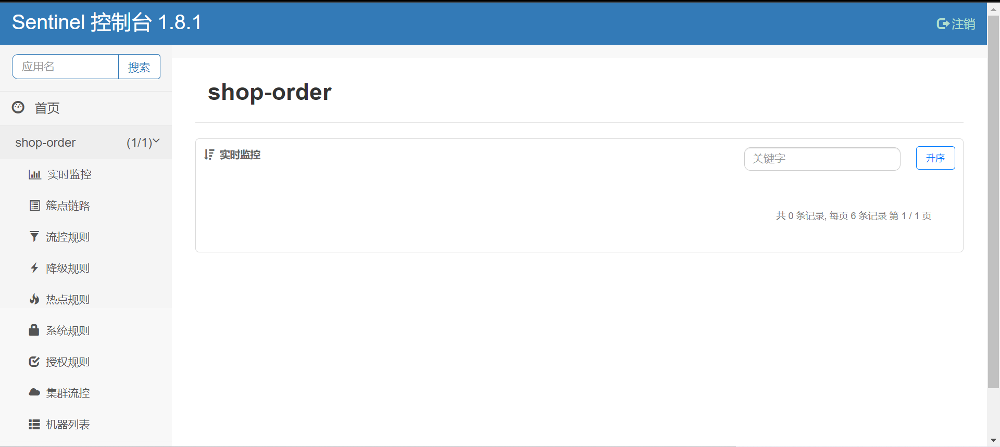
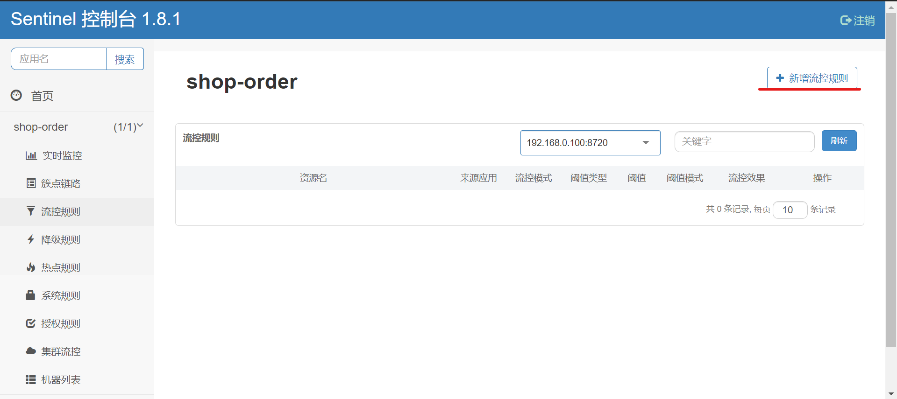
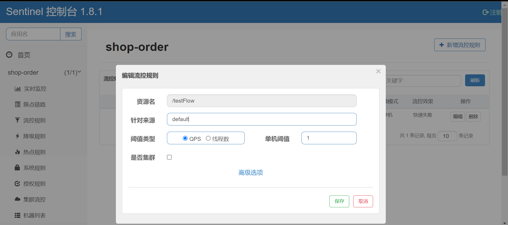
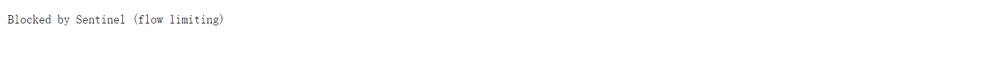
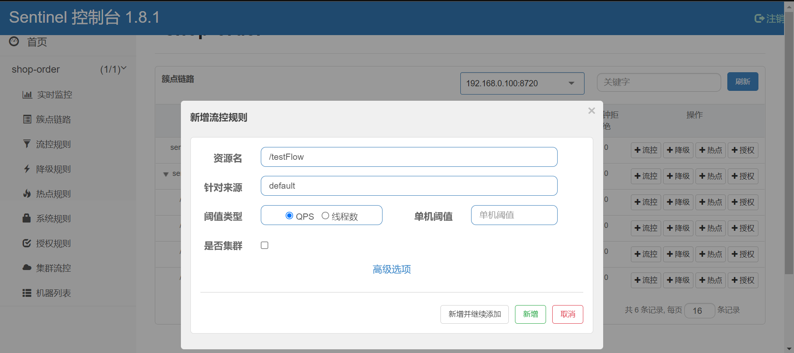
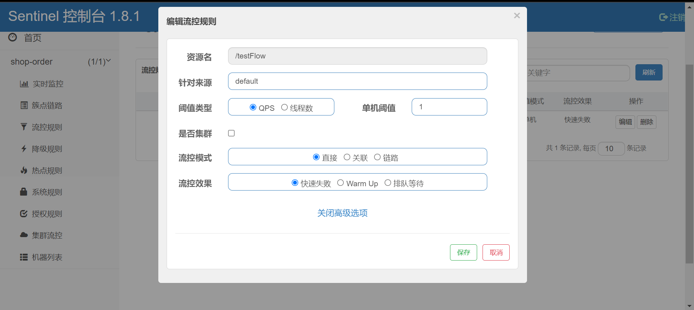
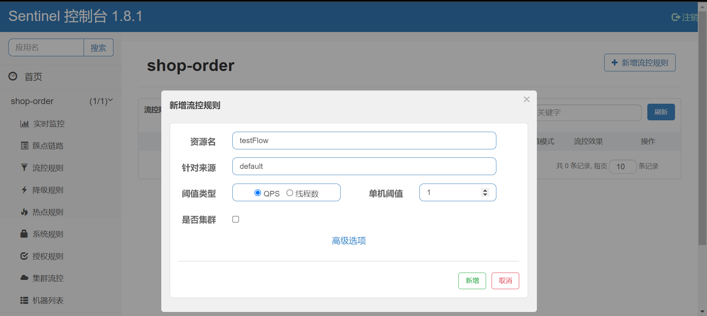
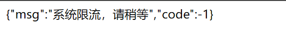

# Sentinel--服务容错

## 服务降级

### 高并发带来的问题

在微服务架构中，我们将业务拆分成一个个的服务，服务与服务之间可以相互调用，但是由于网络原因
或者自身的原因，服务并不能保证服务的100%可用，如果单个服务出现问题，调用这个服务就会出现
网络延迟，此时若有大量的网络涌入，会形成任务堆积，最终导致服务瘫痪。

### 服务雪崩效应

在分布式系统中,由于网络原因或自身的原因,服务一般无法保证 100% 可用。如果一个服务出现了问
题，调用这个服务就会出现线程阻塞的情况，此时若有大量的请求涌入，就会出现多条线程阻塞等待，
进而导致服务瘫痪。
由于服务与服务之间的依赖性，故障会传播，会对整个微服务系统造成灾难性的严重后果，这就是服务
故障的 “**雪崩效应**” 。


雪崩发生的原因多种多样，有不合理的容量设计，或者是高并发下某一个方法响应变慢，亦或是某台机
器的资源耗尽。我们无法完全杜绝雪崩源头的发生，只有做好足够的容错，保证在一个服务发生问题，
不会影响到其它服务的正常运行。也就是＂雪落而不雪崩＂。

### 常见容错方案

要防止雪崩的扩散，我们就要做好服务的容错，容错说白了就是保护自己不被猪队友拖垮的一些措施,
下面介绍常见的服务容错思路和组件。

> 常见的容错思路

常见的容错思路有隔离、超时、限流、熔断、降级这几种，下面分别介绍一下。

* 隔离

它是指将系统按照一定的原则划分为若干个服务模块，各个模块之间相对独立，无强依赖。当有故障发
生时，能将问题和影响隔离在某个模块内部，而不扩散风险，不波及其它模块，不影响整体的系统服
务。常见的隔离方式有：线程池隔离和信号量隔离．


* 超时

在上游服务调用下游服务的时候，设置一个最大响应时间，如果超过这个时间，下游未作出反应，就断开请求，释放掉线程。


* 限流

限流就是限制系统的输入和输出流量已达到保护系统的目的。为了保证系统的稳固运行,一旦达到的需要
限制的阈值,就需要限制流量并采取少量措施以完成限制流量的目的。


* 熔断

在互联网系统中，当下游服务因访问压力过大而响应变慢或失败，上游服务为了保护系统整体的可
用性，可以暂时切断对下游服务的调用。这种牺牲局部，保全整体的措施就叫做熔断。


**服务熔断一般有三种状态**：

* **熔断关闭状态（Closed）**: 服务没有故障时，熔断器所处的状态，对调用方的调用不做任何限制
* **熔断开启状态（Open）**: 后续对该服务接口的调用不再经过网络，直接执行本地的fallback方法
* **半熔断状态（Half-Open）**: 尝试恢复服务调用，允许有限的流量调用该服务，并监控调用成功率。如果成功率达到预期，则说明服
  务已恢复，进入熔断关闭状态；如果成功率仍旧很低，则重新进入熔断关闭状态。

* 降级

降级其实就是为服务提供一个托底方案，一旦服务无法正常调用，就使用托底方案。


### 各服务降级比较


|  |  Sentinel | Hystrix | resilience4j |
| -- | ----------- | --------- | -------- |
| 隔离策略 |  信号量隔离（并发线程数限流） | 线程池隔离/信号量隔离  | 信号量隔离 |
| 熔断降级策略 |  基于响应时间、异常比率、异常数 | 基于异常比率  | 基于异常比率、响应时间 |
| 实时统计实现 |  滑动窗口（LeapArray） | 滑动窗口（基于 RxJava）  | Ring Bit Buffer |
| 动态规则配置 |  支持多种数据源 | 支持多种数据源  | 有限支持 |
| 扩展性 |  多个扩展点 | 插件的形式  | 接口的形式 |
| 基于注解的支持 |  支持 | 支持  | 支持 |
| 限流 |  基于 QPS，支持基于调用关系的限流 | 有限的支持  | Rate Limiter |
| 流量整形 |  支持预热模式、匀速器模式、预热排队模式 | 不支持  | 简单的Rate Limiter模式 |
| 系统自适应保护 |  支持 | 不支持  | 不支持 |
| 控制台 |  提供开箱即用的控制台，可配置规则、查看秒级监控、机器发现等 | 简单的监控查看  | 不提供控制台，可对接其它监控系统 |

### 什么是Sentinel

Sentinel (分布式系统的流量防卫兵) 是阿里开源的一套用于服务容错的综合性解决方案。它以流量
为切入点, 从流量控制、熔断降级、系统负载保护等多个维度来保护服务的稳定性。

**Sentinel 具有以下特征:**

* 丰富的应用场景：Sentinel 承接了阿里巴巴近 10 年的双十一大促流量的核心场景, 例如秒杀（即突发流量控制在系统容量可以承受的范围）、消息削峰填谷、集群流量控制、实时熔断下游不用应用等。
* 完备的实时监控：Sentinel 提供了实时的监控功能。通过控制台可以看到接入应用的单台机器秒级数据, 甚至 500 台以下规模的集群的汇总运行情况。
* 广泛的开源生态：Sentinel 提供开箱即用的与其它开源框架/库的整合模块, 例如与 SpringCloud、Dubbo、gRPC 的整合。只需要引入相应的依赖并进行简单的配置即可快速地接入Sentinel。
* 完善的 SPI 扩展点：Sentinel 提供简单易用、完善的 SPI 扩展接口。您可以通过实现扩展接口来快速地定制逻辑。例如定制规则管理、适配动态数据源等。


**Sentinel分为两个部分:**

* 核心库（Java 客户端）不依赖任何框架/库,能够运行于所有 Java 运行时环境，同时对 Dubbo
  /Spring Cloud 等框架也有较好的支持。
* 控制台（Dashboard）基于 Spring Boot 开发，打包后可以直接运行，不需要额外的 Tomcat 等
  应用容器。

Sentinel 的开源生态：


## 安装Sentinel控制台  

Sentinel 提供一个轻量级的控制台, 它提供机器发现、单机资源实时监控以及规则管理等功能。

1. 下载jar包,解压到文件夹

下载地址：[https://github.com/alibaba/Sentinel/releases](https://github.com/alibaba/Sentinel/releases)

2. 启动控制台

```shell
# 直接使用jar命令启动项目(控制台本身是一个SpringBoot项目)
# 这里的sentinel-dashboard-1.8.1.jar即时下载的jar包名称
java -jar sentinel-dashboard-1.8.1.jar --server.port=9000
```

* 浏览器地址栏输入：[http://localhost:9000](http://localhost:9000)
* 默认用户名、密码均为sentinel


## 订单微服务集成Sentinel

1. 修改pom.xml文件，引入sentinel依赖

在<dependencies>节点下引入sentinel依赖

```xml
<!--sentinel 核心环境 依赖-->
<dependencies>
    <dependency>
        <groupId>com.alibaba.cloud</groupId>
        <artifactId>spring-cloud-starter-alibaba-sentinel</artifactId>
    </dependency>
    <!-- Sentinel支持采用 Nacos 作为规则配置数据源，引入该适配依赖 -->
    <dependency>
        <groupId>com.alibaba.csp</groupId>
        <artifactId>sentinel-datasource-nacos</artifactId>
    </dependency>
</dependencies>
```

2. 修改bootstrap-dev.yml文件

```yaml
spring:
  cloud:
    sentinel:
      transport:
        dashboard: 127.0.0.1:9000 #配置Sentinel dashboard地址
        port: 8719  #这个端口配置会在应用对应的机器上启动一个Http Server，该Server会与 Sentinel 控制台做交互
```

3. 增加两个测试controller方法

```java
package com.rea.order.controller;

import org.springframework.web.bind.annotation.GetMapping;
import org.springframework.web.bind.annotation.RestController;

/**
 * @author CRR
 */
@RestController
public class SentinelController {

    @GetMapping("/testFlow")
    public String testFlow() {
        return "testFlow";
    }

    @GetMapping("/testDegrade")
    public String testDegrade() {
        return "testDegrade";
    }
}

```

4. 启动项目，浏览器输入：[http://localhost:8011/testFlow](http://localhost:8011/testFlow)，此时在sentinel控制台可以看到已经对shop-order服务进行了监控




### 实现一个接口的限流

1. 通过控制台为testFlow添加一个流控规则




2. 通过控制台快速频繁访问, 观察效果



## Sentinel的概念和功能

###  基本概念

> Sentinel 的基本概念有两个，它们分别是：资源和规则。

| 基本概念 | 描述                                                                                                                                                                   |
|------|----------------------------------------------------------------------------------------------------------------------------------------------------------------------|
| 资源   | 资源是 Sentinel 的关键概念。它可以是 Java 应用程序中的任何内容，例如由应用程序提供的服务或者是服务里的方法，甚至可以是一段代码。我们可以通过 Sentinel 提供的 API 来定义一个资源，使其能够被 Sentinel 保护起来。通常情况下，我们可以使用方法名、URL 甚至是服务名来作为资源名来描述某个资源。 |
| 规则   | 围绕资源而设定的规则。Sentinel 支持流量控制、熔断降级、系统保护、来源访问控制和热点参数等多种规则，所有这些规则都可以动态实时调整。                                                                                               |

### 重要功能


Sentinel的主要功能就是容错，主要体现为下面这三个：

* 流量控制

流量控制在网络传输中是一个常用的概念，它用于调整网络包的数据。任意时间到来的请求往往是随机
不可控的，而系统的处理能力是有限的。我们需要根据系统的处理能力对流量进行控制。Sentinel 作为
一个调配器，可以根据需要把随机地请求调整成合适的形状。

* 熔断降级

当检测到调用链路中某个资源出现不稳定地表现，例如请求响应时间长或异常比例升高的时候，则对这
个资源的调用进行限制，让请求快速失败，避免影响到其它的资源而导致级联故障

**Sentinel 对这个问题采取了两种手段:**

* 通过并发线程数进行限制

Sentinel 通过限制资源并发线程的数量，来减少不稳定资源对其它资源的影响。当某个资源出现不稳定
的情况下，例如响应时间变长，对资源的直接影响就是会造成线程数的逐步堆积。当线程数在特定资源
上堆积到一定的数量之后，对该资源的新请求就会被拒绝。堆积的线程完成任务后才开始继续接收请
求。

* 通过响应时间对资源进行降级

除了对并发线程数进行控制以外，Sentinel 还可以通过响应时间来快速降级不稳定的资源。当依赖的资
源出现响应时间过长后，所有对该资源的访问都会被直接拒绝，直到过了指定的时间窗口之后才重新恢
复。


## Sentinel规则

### 流控规则

流量控制，其原理是监控应用流量的QPS(每秒查询率) 或并发线程数等指标，当达到指定的阈值时对流
量进行控制，以避免被瞬时的流量高峰冲垮，从而保障应用的高可用性。
第1步: 点击簇点链路，我们就可以看到访问过的接口地址，然后点击对应的流控按钮，进入流控规则配
置页面。




**资源名**：唯一名称，默认是请求路径，可自定义  
**针对来源**：指定对哪个微服务进行限流，默认指default，意思是不区分来源，全部限制  
**阈值类型单机阈值**： 
  * QPS（每秒请求数量）: 当调用该接口的QPS达到阈值的时候，进行限流
  * 线程数：当调用该接口的线程数达到阈值的时候，进行限流   

**是否集群**：暂不需要集群

#### 配置流控模式

点击上面设置流控规则的编辑按钮，然后在编辑页面点击**高级选项**，会看到有流控模式一栏



**sentinel共有三种流控模式，分别是：**

**直接**（默认）：接口达到限流条件时，开启限流
**关联**：当关联的资源达到限流条件时，开启限流 [适合做应用让步]
**链路**：当从某个接口过来的资源达到限流条件时，开启限流

下面呢分别演示三种模式：

**直接流控模式**

直接流控模式是最简单的模式，当指定的接口达到限流条件时开启限流。上面案例使用的就是直接流控模式。

**关联流控模式**

关联流控模式指的是，当指定接口关联的接口达到限流条件时，开启对指定接口开启限流。
1. 配置限流规则,将流控模式设置为关联，关联资源设置为的 /testDegrade。
2. 访问[http://localhost:8011/testDegrade](http://localhost:8011/testDegrade)，向/testDegrade发送请求，一秒超过1次
3. 访问[http://localhost:8011/testFlow](http://localhost:8011/testFlow)，会发现已经被限流

**链路流控模式**

链路流控模式指的是，当从某个接口过来的资源达到限流条件时，开启限流。它的功能有点类似于针对
来源配置项，区别在于：**针对来源是针对上级微服务**，而链路流控是针对上级接口，也就是说它的粒度
更细。

### 降级规则

**降级规则就是设置当满足什么条件的时候，对服务进行降级。Sentinel提供了三个衡量条件：**

* **平均响应时间** ：当资源的平均响应时间超过阈值（以 ms 为单位）之后，资源进入准降级状态。
如果接下来 1s 内持续进入 5 个请求，它们的 RT都持续超过这个阈值，那么在接下的时间窗口
（以 s 为单位）之内，就会对这个方法进行服务降级。

> 注意 Sentinel 默认统计的 RT 上限是 4900 ms，超出此阈值的都会算作 4900 ms，若需要变更此
上限可以通过启动配置项 -Dcsp.sentinel.statistic.max.rt=xxx 来配置。

* **异常比例**：当资源的每秒异常总数占通过量的比值超过阈值之后，资源进入降级状态，即在接下的
时间窗口（以 s 为单位）之内，对这个方法的调用都会自动地返回。异常比率的阈值范围是[0.0,1.0]。

* **异常数** ：当资源近 1 分钟的异常数目超过阈值之后会进行服务降级。注意由于统计时间窗口是分
钟级别的，若时间窗口小于 60s，则结束熔断状态后仍可能再进入熔断状态。

### 热点规则

热点参数流控规则是一种更细粒度的流控规则, 它允许将规则具体到参数上。

暂不考虑热点规则的学习

### 授权规则

很多时候，我们需要根据调用来源来判断该次请求是否允许放行，这时候可以使用 Sentinel 的来源访问
控制的功能。来源访问控制根据资源的请求来源（origin）限制资源是否通过：

* 若配置白名单，则只有请求来源位于白名单内时才可通过；
* 若配置黑名单，则请求来源位于黑名单时不通过，其余的请求通过。

### 系统规则

系统保护规则是从应用级别的入口流量进行控制，从单台机器的总体 Load、RT、入口 QPS 、CPU使用
率和线程数五个维度监控应用数据，让系统尽可能跑在最大吞吐量的同时保证系统整体的稳定性。系统
保护规则是应用整体维度的，而不是资源维度的，并且仅对入口流量 (进入应用的流量) 生效。

* Load（仅对 Linux/Unix-like 机器生效）：当系统 load1 超过阈值，且系统当前的并发线程数超过系统容量时才会触发系统保护。系统容量由系统的 maxQps * minRt 计算得出。设定参考值一般是 CPU cores * 2.5
* RT：当单台机器上所有入口流量的平均 RT 达到阈值即触发系统保护，单位是毫秒。
* 线程数：当单台机器上所有入口流量的并发线程数达到阈值即触发系统保护。
* 入口 QPS：当单台机器上所有入口流量的 QPS 达到阈值即触发系统保护。
* CPU使用率：当单台机器上所有入口流量的 CPU使用率达到阈值即触发系统保护

##  @SentinelResource的使用

在定义了资源点之后，我们可以通过Dashboard来设置限流和降级策略来对资源点进行保护。同时还能
通过@SentinelResource来指定出现异常时的处理策略。

@SentinelResource 用于定义资源，并提供可选的异常处理和 fallback 配置项。其主要参数如下:

| 属性                 | 作用                                                                                                                                                                                                                                     |
|--------------------|----------------------------------------------------------------------------------------------------------------------------------------------------------------------------------------------------------------------------------------|
| value              | 资源名称                                                                                                                                                                                                                                   |
| entryType          | entry类型，标记流量的方向，取值IN/OUT，默认是OUT                                                                                                                                                                                                        |
| blockHandler       | 处理BlockException的函数名称,函数要求：<br/>1. 必须是 public<br/>2. 返回类型参数与原方法一致<br/>3. 默认需和原方法在同一个类中。若希望使用其他类的函数，可配置blockHandlerClass ，并指定blockHandlerClass里面的方法。                                                                                    |
| blockHandlerClass  | 存放blockHandler的类,对应的处理函数必须static修饰。                                                                                                                                                                                                    |
| fallback           | 用于在抛出异常的时候提供fallback处理逻辑。fallback函数可以针对所有类型的异常（除了exceptionsToIgnore 里面排除掉的异常类型）进行处理。函数要求：<br/>1. 返回类型与原方法一致<br/>2. 参数类型需要和原方法相匹配<br/>3. 默认需和原方法在同一个类中。若希望使用其他类的函数，可配置fallbackClass ，并指定fallbackClass里面的方法。                             |
| fallbackClass      | 存放fallback的类。对应的处理函数必须static修饰。                                                                                                                                                                                                        |
| defaultFallback    | 用于通用的 fallback 逻辑。默认fallback函数可以针对所有类型的异常进行处理。若同时配置了 fallback 和 defaultFallback，以fallback为准。函数要求：<br/>1. 返回类型与原方法一致<br/>2. 方法参数列表为空，或者有一个Throwable 类型的参数。<br/>3. 默认需要和原方法在同一个类中。若希望使用其他类的函数，可配置fallbackClass ，并指定 fallbackClass 里面的方法。 |
| exceptionsToIgnore | 指定排除掉哪些异常。排除的异常不会计入异常统计，也不会进入fallback逻辑，而是原样抛出                                                                                                                                                                                         |
| exceptionsToTrace  | 需要trace的异常                                                                                                                                                                                                                             |

### 项目整合

1. 在shop-order服务的com.rea.order.controller下新建BlockHandler类

```java
package com.rea.order.controller;

import com.alibaba.csp.sentinel.slots.block.BlockException;
import com.alibaba.csp.sentinel.slots.block.degrade.DegradeException;
import com.alibaba.csp.sentinel.slots.block.flow.FlowException;
import com.alibaba.fastjson.JSON;

import java.util.HashMap;
import java.util.Map;

/**
 * @author CRR
 */
public class BlockHandler {
    public static String handleException(BlockException be) {
        Map<String, Object> map = new HashMap<>();
        if(be instanceof FlowException) {
            map.put("code", -1);
            map.put("msg", "系统限流，请稍等");
        } else if(be instanceof DegradeException) {
            map.put("code", -2);
            map.put("msg", "降级了");
        }
        return JSON.toJSONString(map);
    }

    public static String handlerError() {
        Map<String, Object> map = new HashMap<>();
        map.put("code", 500);
        map.put("msg", "系统异常");
        return JSON.toJSONString(map);
    }
}
```

2. 修改SentinelController类，使用注解@SentinelResource

```java
package com.rea.order.controller;

import com.alibaba.csp.sentinel.annotation.SentinelResource;
import org.springframework.web.bind.annotation.GetMapping;
import org.springframework.web.bind.annotation.RestController;

/**
 * @author CRR
 */
@RestController
public class SentinelController {

    @GetMapping("/testFlow")
    @SentinelResource(value = "testFlow",
            blockHandlerClass = BlockHandler.class,
            blockHandler = "handleException",
            fallback = "handlerError",
            fallbackClass = BlockHandler.class)
    public String testFlow() {
        return "testFlow";
    }

    @GetMapping("/testDegrade")
    @SentinelResource(value = "testDegrade",
            blockHandlerClass = BlockHandler.class,
            blockHandler = "handleException",
            fallback = "handlerError",
            fallbackClass = BlockHandler.class)
    public String testDegrade() {
        return "testDegrade";
    }
}
```

### 配置流控规则


> 这里配置的不再是路径，而是注解的value值

浏览器访问：[http://localhost:8011/testFlow](http://localhost:8011/testFlow)，连续刷新多次访问


降级规则类似

## Sentinel规则持久化

通过前面的讲解，我们已经知道，可以通过Dashboard来为每个Sentinel客户端设置各种各样的规则，
但是这里有一个问题，就是这些规则默认是存放在内存中，极不稳定，所以需要将其持久化。

这里结合nacos配置持久化规则

1. 修改配置文件bootstrap-dev.yml，sentinel下新建datasource节点，配置信息如下：

```yaml
spring:
  cloud:
    nacos:
      discovery:
        server-addr: 127.0.0.1:8848
        namespace: dfa414fe-6383-45bc-9a31-803a9c475c57
      config:
        server-addr: 127.0.0.1:8848
        namespace: dfa414fe-6383-45bc-9a31-803a9c475c57
        file-extension: yml   #默认properties
    sentinel:
      transport:
        dashboard: http://localhost:9000 #配置Sentinel dashboard地址
        port: 8719  #这个端口配置会在应用对应的机器上启动一个Http Server，该Server会与 Sentinel 控制台做交互
      datasource:
        flow:
          nacos:
            server-addr: http://localhost:8848
            namespace: dfa414fe-6383-45bc-9a31-803a9c475c57
            dataId: sentinel-flow-service #nacos中存储规则的dataId
            data-type: json #配置文件类型
            rule-type: flow #类型来自RuleType类 - 流控规则
        degrade:
          nacos:
            server-addr: http://localhost:8848
            namespace: dfa414fe-6383-45bc-9a31-803a9c475c57
            dataId: sentinel-degrade-service #nacos中存储规则的dataId
            data-type: json #配置文件类型
            rule-type: degrade #类型来自RuleType类 - 熔断规则
dubbo:
  registry:
    address: spring-cloud://localhost
  cloud:
    subscribed-services: shop-product
```

2. nacos在配置列表中新建sentinel-degrade-service配置

> 后面会讲到nacos作为配置中心的作用，这里仅做了解

```yaml
[
  {
    "resource": "testDegrade",
    "grade":   0,
    "count":   2,
    "timeWindow": 3,
    "minRequestAmount": 5,
    "statIntervalMs": 1000,
    "slowRatioThreshold":1
  }
]
```

3. nacos在配置列表中新建sentinel-flow-service配置

```yaml
[
  {
    "resource": "testFlow",
    "limitApp": "default",
    "grade":   1,
    "count":   1,
    "strategy": 0,
    "controlBehavior": 0,
    "clusterMode": false
  }
]
```

4. 重新服务，让配置文件生效

浏览器访问：[http://localhost:8011/testFlow](http://localhost:8011/testFlow)，连续刷新多次访问


