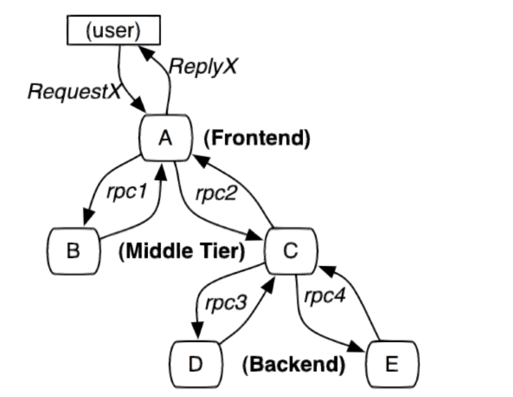
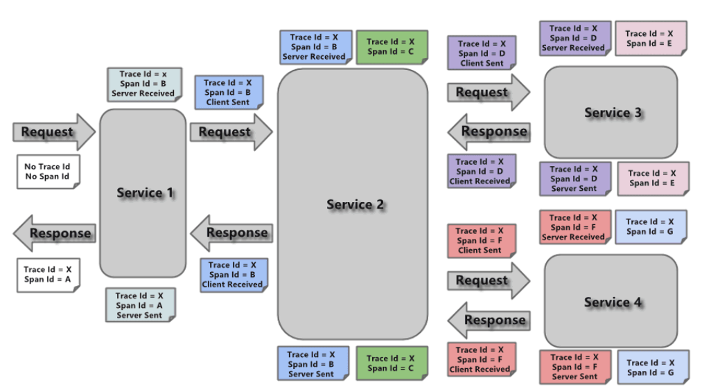
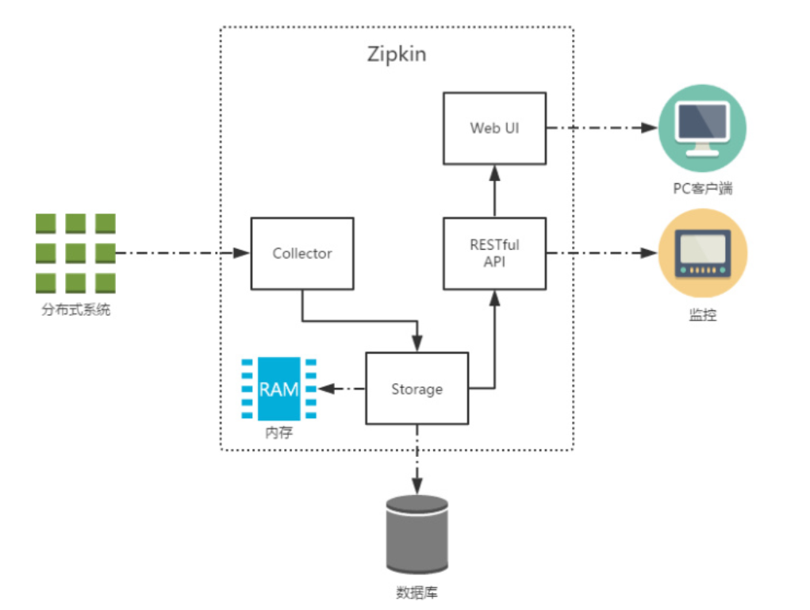
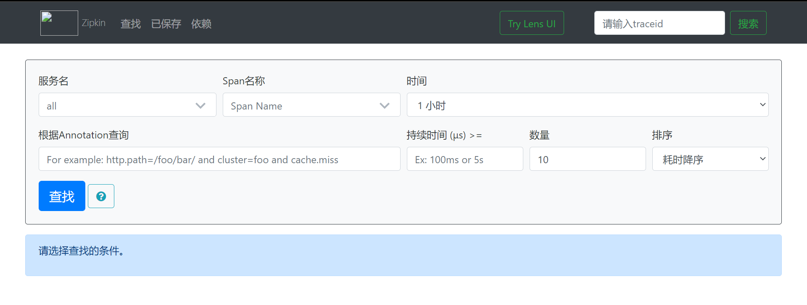
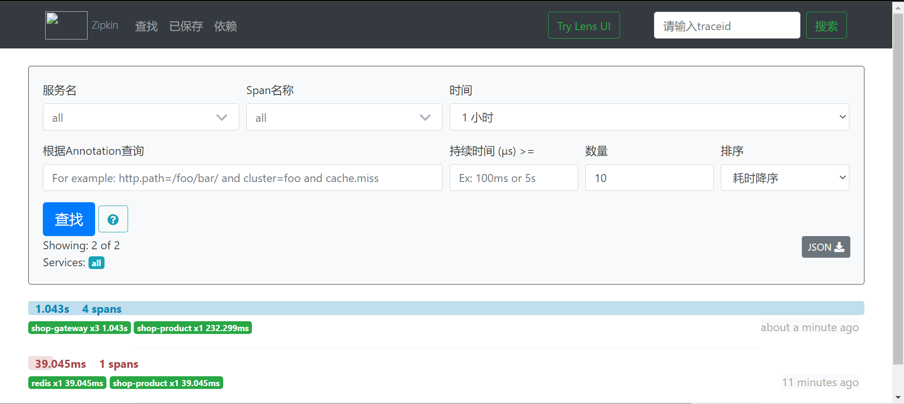
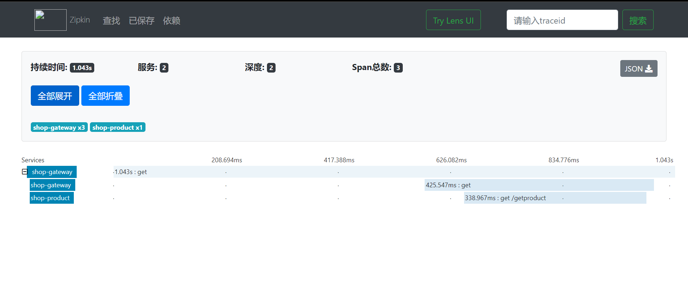

# Sleuth--链路追踪

## 链路追踪介绍

在大型系统的微服务化构建中，一个系统被拆分成了许多模块。这些模块负责不同的功能，组合成系
统，最终可以提供丰富的功能。在这种架构中，一次请求往往需要涉及到多个服务。互联网应用构建在
不同的软件模块集上，这些软件模块，有可能是由不同的团队开发、可能使用不同的编程语言来实现、
有可能布在了几千台服务器，横跨多个不同的数据中心，也就意味着这种架构形式也会存在一些问题：

* 如何快速发现问题？
* 如何判断故障影响范围？
* 如何梳理服务依赖以及依赖的合理性？
* 如何分析链路性能问题以及实时容量规划？



分布式链路追踪（Distributed Tracing），就是将一次分布式请求还原成调用链路，进行日志记录，性
能监控并将一次分布式请求的调用情况集中展示。比如各个服务节点上的耗时、请求具体到达哪台机器
上、每个服务节点的请求状态等等。

常见的链路追踪技术有下面这些：

* cat: 由大众点评开源，基于Java开发的实时应用监控平台，包括实时应用监控，业务监控 。 集成
  方案是通过代码埋点的方式来实现监控，比如： 拦截器，过滤器等。 对代码的侵入性很大，集成
  成本较高。风险较大。
* zipkin: 由Twitter公司开源，开放源代码分布式的跟踪系统，用于收集服务的定时数据，以解决微
  服务架构中的延迟问题，包括：数据的收集、存储、查找和展现。该产品结合spring-cloud-sleuth
  使用较为简单， 集成很方便， 但是功能较简单。
* pinpoint: Pinpoint是韩国人开源的基于字节码注入的调用链分析，以及应用监控分析工具。特点
  是支持多种插件，UI功能强大，接入端无代码侵入。
* skywalking: SkyWalking是本土开源的基于字节码注入的调用链分析，以及应用监控分析工具。
  特点是支持多种插件，UI功能较强，接入端无代码侵入。目前已加入Apache孵化器。
* Sleuth:SpringCloud 提供的分布式系统中链路追踪解决方案

**注意：SpringCloud alibaba技术栈中并没有提供自己的链路追踪技术的，我们可以采用Sleuth+Zipkin来做链路追踪解决方案**

## Sleuth入门

### Sleuth介绍

SpringCloud Sleuth主要功能就是在分布式系统中提供追踪解决方案。它大量借用了Google Dapper的
设计， 先来了解一下Sleuth中的术语和相关概念。

**Trace**:由一组Trace Id相同的Span串联形成一个树状结构。为了实现请求跟踪，当请求到达分布式系统
的入口端点时，只需要服务跟踪框架为该请求创建一个唯一的标识（即TraceId），同时在分布式系统
内部流转的时候，框架始终保持传递该唯一值，直到整个请求的返回。那么我们就可以使用该唯一标识
将所有的请求串联起来，形成一条完整的请求链路。

**Span** 代表了一组基本的工作单元。为了统计各处理单元的延迟，当请求到达各个服务组件的时候，也
通过一个唯一标识（SpanId）来标记它的开始、具体过程和结束。通过SpanId的开始和结束时间戳，
就能统计该span的调用时间，除此之外，我们还可以获取如事件的名称。请求信息等元数据。

**Annotation**

用它记录一段时间内的事件，内部使用的重要注释：
cs（Client Send）客户端发出请求，开始一个请求的生命
sr（Server Received）服务端接受到请求开始进行处理， sr－cs = 网络延迟（服务调用的时间）
ss（Server Send）服务端处理完毕准备发送到客户端，ss - sr = 服务器上的请求处理时间
cr（Client Received）客户端接受到服务端的响应，请求结束。 cr - sr = 请求的总时间



### Sleuth入门

微服务名称, traceId, spanid,是否将链路的追踪结果输出到第三方平台

接下来通过之前的项目案例整合Sleuth，完成入门案例的编写。

修改**父工程**引入Sleuth依赖

```xml
<dependency>
    <groupId>org.springframework.cloud</groupId>
    <artifactId>spring-cloud-starter-sleuth</artifactId>
</dependency>
```

启动微服务，浏览器输入[http://localhost:8008/product/getProduct?pid=1](http://localhost:8008/product/getProduct?pid=1)，
我们可以在控制台观察到sleuth的日志输出

```
2022-01-03 10:14:53.701  INFO [shop-product,b5673a7d48ab49ff,64ae7218d109ce90,true] 16120 --- [nio-8010-exec-4] c.r.p.service.impl.ProductServiceImpl    : >>-----远程调用商品服务查找商品
2022-01-03 10:14:53.705  INFO [shop-product,b5673a7d48ab49ff,64ae7218d109ce90,true] 16120 --- [nio-8010-exec-4] c.r.p.controller.ProductController       : 查询到商品:{"pid":1,"price":1000,"name":"小米","stock":"5000"}
```
其中 b5673a7d48ab49ff 是TraceId， 64ae7218d109ce90 是SpanId，依次调用有一个全局的
TraceId，将调用链路串起来。仔细分析每个微服务的日志，不难看出请求的具体过程。
查看日志文件并不是一个很好的方法，当微服务越来越多日志文件也会越来越多，通过Zipkin可以将日
志聚合，并进行可视化展示和全文检索。


## Zipkin的集成

### ZipKin介绍

Zipkin是Twitter的一个开源项目，它基于Google Dapper实现，它致力于收集服务的定时数据，以解
决微服务架构中的延迟问题，包括**数据的收集、存储、查找和展现**

我们可以使用它来收集各个服务器上请求链路的跟踪数据，并通过它提供的REST API接口来辅助我们查
询跟踪数据以实现对分布式系统的监控程序，从而及时地发现系统中出现的延迟升高问题并找出系统性
能瓶颈的根源。

除了面向开发的 API 接口之外，它也提供了方便的UI组件来帮助我们直观的搜索跟踪信息和分析请求链
路明细，比如：可以查询某段时间内各用户请求的处理时间等。

Zipkin提供了可插拔数据存储方式：In-Memory、MySql、Cassandra 以及 Elasticsearch。



上图展示了 Zipkin 的基础架构，它主要由 4 个核心组件构成：

* Collector：收集器组件，它主要用于处理从外部系统发送过来的跟踪信息，将这些信息转换为
  Zipkin内部处理的Span格式，以支持后续的存储、分析、展示等功能。
* Storage：存储组件，它主要对处理收集器接收到的跟踪信息，默认会将这些信息存储在内存中，
  我们也可以修改此存储策略，通过使用其他存储组件将跟踪信息存储到数据库中。
* RESTful API：API组件，它主要用来提供外部访问接口。比如给客户端展示跟踪信息，或是外接
  系统访问以实现监控等。
* Web UI：UI 组件， 基于API组件实现的上层应用。通过UI组件用户可以方便而有直观地查询和分
  析跟踪信息。

Zipkin分为两端，一个是Zipkin服务端，一个是Zipkin客户端，客户端也就是微服务的应用。 客户端会
配置服务端的URL地址，一旦发生服务间的调用的时候，会被配置在微服务里面的Sleuth的监听器监
听，并生成相应的Trace和Span信息发送给服务端。

### ZipKin服务端安装

1. 下载ZipKin的jar包

[https://search.maven.org/remote_content?g=io.zipkin.java&a=zipkin-server&v=LATEST&c=exec](https://search.maven.org/remote_content?g=io.zipkin.java&a=zipkin-server&v=LATEST&c=exec)

访问上面的网址，即可得到一个jar包，这就是ZipKin服务端的jar包

2. 通过命令行，输入下面的命令启动ZipKin Server

```shell
java -jar zipkin-server-2.12.9-exec.jar
```

3. 通过浏览器访问 [http://localhost:9411](http://localhost:9411)访问



### Zipkin客户端集成

ZipKin客户端和Sleuth的集成非常简单，只需要在微服务中添加其依赖和配置即可

1. 在父工程添加依赖

```xml
<dependency>
    <groupId>org.springframework.cloud</groupId>
    <artifactId>spring-cloud-starter-zipkin</artifactId>
</dependency>
```

2. 添加配置，在网关和商品服务中添加以下配置

```yaml
spring:
  zipkin:
    base-url: http://127.0.0.1:9411/ #zipkin server的请求地址
    discovery-client-enabled: false #让nacos把它当成一个URL，而不要当做服务名
  sleuth:
    sampler:
      probability: 1.0  #采样的百分比
```

3. 启动服务 

浏览器访问[http://localhost:8008/product/getProduct?pid=1](http://localhost:8008/product/getProduct?pid=1)

4. 访问zipkin的UI界面，观察效果



5. 点击其中一条记录，可观察一次访问的详细线路。



## ZipKin数据持久化

Zipkin Server默认会将追踪数据信息保存到内存，但这种方式不适合生产环境。Zipkin支持将追踪数据
持久化到mysql数据库或elasticsearch中。

### 使用mysql实现数据持久化

1. 创建mysql数据环境

```mysql
CREATE SCHEMA `zipkin` ;

CREATE TABLE IF NOT EXISTS zipkin_spans (
  `trace_id_high` BIGINT NOT NULL DEFAULT 0 COMMENT 'If non zero, this means the trace uses 128 bit traceIds instead of 64 bit',
  `trace_id` BIGINT NOT NULL,
  `id` BIGINT NOT NULL,
  `name` VARCHAR(255) NOT NULL,
  `parent_id` BIGINT,
  `debug` BIT(1),
  `start_ts` BIGINT COMMENT 'Span.timestamp(): epoch micros used for endTs query and to implement TTL',
  `duration` BIGINT COMMENT 'Span.duration(): micros used for minDuration and maxDuration query'
) ENGINE=InnoDB ROW_FORMAT=COMPRESSED CHARACTER SET=utf8 COLLATE utf8_general_ci;

ALTER TABLE zipkin_spans ADD UNIQUE KEY(`trace_id_high`, `trace_id`, `id`) COMMENT 'ignore insert on duplicate';
ALTER TABLE zipkin_spans ADD INDEX(`trace_id_high`, `trace_id`, `id`) COMMENT 'for joining with zipkin_annotations';
ALTER TABLE zipkin_spans ADD INDEX(`trace_id_high`, `trace_id`) COMMENT 'for getTracesByIds';
ALTER TABLE zipkin_spans ADD INDEX(`name`) COMMENT 'for getTraces and getSpanNames';
ALTER TABLE zipkin_spans ADD INDEX(`start_ts`) COMMENT 'for getTraces ordering and range';

CREATE TABLE IF NOT EXISTS zipkin_annotations (
  `trace_id_high` BIGINT NOT NULL DEFAULT 0 COMMENT 'If non zero, this means the trace uses 128 bit traceIds instead of 64 bit',
  `trace_id` BIGINT NOT NULL COMMENT 'coincides with zipkin_spans.trace_id',
  `span_id` BIGINT NOT NULL COMMENT 'coincides with zipkin_spans.id',
  `a_key` VARCHAR(255) NOT NULL COMMENT 'BinaryAnnotation.key or Annotation.value if type == -1',
  `a_value` BLOB COMMENT 'BinaryAnnotation.value(), which must be smaller than 64KB',
  `a_type` INT NOT NULL COMMENT 'BinaryAnnotation.type() or -1 if Annotation',
  `a_timestamp` BIGINT COMMENT 'Used to implement TTL; Annotation.timestamp or zipkin_spans.timestamp',
  `endpoint_ipv4` INT COMMENT 'Null when Binary/Annotation.endpoint is null',
  `endpoint_ipv6` BINARY(16) COMMENT 'Null when Binary/Annotation.endpoint is null, or no IPv6 address',
  `endpoint_port` SMALLINT COMMENT 'Null when Binary/Annotation.endpoint is null',
  `endpoint_service_name` VARCHAR(255) COMMENT 'Null when Binary/Annotation.endpoint is null'
) ENGINE=InnoDB ROW_FORMAT=COMPRESSED CHARACTER SET=utf8 COLLATE utf8_general_ci;

ALTER TABLE zipkin_annotations ADD UNIQUE KEY(`trace_id_high`, `trace_id`, `span_id`, `a_key`, `a_timestamp`) COMMENT 'Ignore insert on duplicate';
ALTER TABLE zipkin_annotations ADD INDEX(`trace_id_high`, `trace_id`, `span_id`) COMMENT 'for joining with zipkin_spans';
ALTER TABLE zipkin_annotations ADD INDEX(`trace_id_high`, `trace_id`) COMMENT 'for getTraces/ByIds';
ALTER TABLE zipkin_annotations ADD INDEX(`endpoint_service_name`) COMMENT 'for getTraces and getServiceNames';
ALTER TABLE zipkin_annotations ADD INDEX(`a_type`) COMMENT 'for getTraces';
ALTER TABLE zipkin_annotations ADD INDEX(`a_key`) COMMENT 'for getTraces';
ALTER TABLE zipkin_annotations ADD INDEX(`trace_id`, `span_id`, `a_key`) COMMENT 'for dependencies job';

CREATE TABLE IF NOT EXISTS zipkin_dependencies (
  `day` DATE NOT NULL,
  `parent` VARCHAR(255) NOT NULL,
  `child` VARCHAR(255) NOT NULL,
  `call_count` BIGINT
) ENGINE=InnoDB ROW_FORMAT=COMPRESSED CHARACTER SET=utf8 COLLATE utf8_general_ci;

ALTER TABLE zipkin_dependencies ADD UNIQUE KEY(`day`, `parent`, `child`);
```

2. 在启动ZipKin Server的时候,指定数据保存的mysql的信息

```shell
java -jar zipkin-server-2.12.9-exec.jar --STORAGE_TYPE=mysql --
MYSQL_HOST=127.0.0.1 --MYSQL_TCP_PORT=3306 --MYSQL_DB=zipkin --MYSQL_USER=root -
-MYSQL_PASS=root
```

### 使用elasticsearch实现数据持久化

1. 下载elasticsearch

下载地址：[https://www.elastic.co/cn/downloads/past-releases/elasticsearch-6-8-4](https://www.elastic.co/cn/downloads/past-releases/elasticsearch-6-8-4)

2. 启动elasticsearch
3. 在启动ZipKin Server的时候，指定数据保存的elasticsearch的信息

```shell
java -jar zipkin-server-2.12.9-exec.jar --STORAGE_TYPE=elasticsearch --ESHOST=localhost:9200
```


